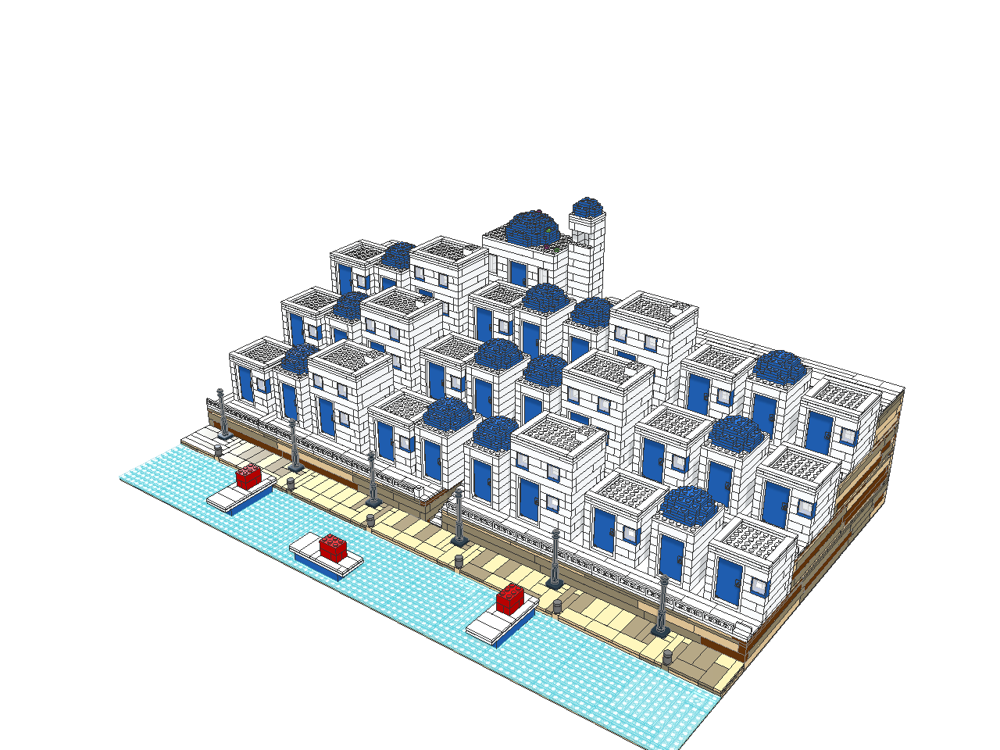

# Building with agents: Build Scripts

A **build script** is a small JSON program that compiles into real LDraw parts. An agent (or a person) describes _what_ to build — walls with doors and windows, floors, roofs, towers, domes, stairs, repeated houses — and the compiler chooses and places the bricks: largest pieces first, joints staggered course to course, only piece sizes that exist in the chosen colour. Every compile is checked for overlapping parts, off-grid parts and floating (unconnected) parts, and the report names the op that caused each problem, so an agent can fix its script and compile again.

The ready-to-paste system prompt is [prompts/build-agent.md](../prompts/build-agent.md). What official sets do that makes them look like LEGO designs, measured on 30 OMR models, is in [DESIGN-LANGUAGE.md](DESIGN-LANGUAGE.md); the rules drawn from it are [below](#design-rules-from-official-sets). The JSON Schema is [schemas/buildScript.v1.json](../schemas/buildScript.v1.json); `npm run cli -- build --reference` prints the op reference.

Why this shape: [MineBench](https://github.com/Ammaar-Alam/minebench) — an LLM benchmark of large voxel builds — gets builds of thousands to millions of blocks out of models by having them emit a few high-level primitives (boxes, lines, a JavaScript loop) instead of block-by-block lists, inside a bounded grid with a fixed palette, after planning the silhouette; judges then compare the builds from every camera angle. A build script is the brick version of that: boxes and walls instead of bricks, repeat/mirror/components instead of copy-paste, palettes instead of colour codes, and a report plus rendered views instead of guessing. A 5 KB script compiles to 4,000+ parts ([Santorini example](#worked-examples)).

## Quick start

```sh
# Compile, check and write an LDraw file (and a report next to it)
npm run cli -- build --script fixtures/build-scripts/house.json --output house.mpd
# … plus rendered review views (iso, front, back, left, right, top, iso-back)
npm run cli -- build --script house.json --output house.mpd \
  --render views/house.png --views iso,front,iso-back
# Find parts without knowing their numbers
npm run cli -- parts search "cheese slope" --colour red --available
npm run cli -- parts search --size 1x2 --category Tiles
```

In a browser with `?automation=1`:

```js
const api = window.brickEditor;
const check = await api.buildScript.validate(script); // {valid, issues}
const { report } = await api.buildScript.compile({ script }); // no change
const applied = await api.buildScript.apply({ script }); // replaces the project
const { results } = await api.parts.search({
  query: "1x2 tile",
  colour: "white",
});
```

In the app: **Open file** (pinned at the top of the Project menu) accepts a build script (`.json`).

## Coordinates

- **x** and **z** are in **studs**; **y** is in **plates** (a brick is 3 plates). Any height may be written `"4b"` (4 bricks = 12 plates).
- **y = 0 is the ground** (the top of a baseplate). A part's `y` is the level its underside rests on.
- **The front faces −Z.** `facing: "front"` is −Z, `"back"` +Z, `"left"` −X, `"right"` +X.
- `at` is always the **minimum corner** (smallest x, y, z) of what an op fills; `size` is `[w, h, d]` (studs, plates, studs) or `[w, d]` for flat things.
- A 32 × 32 baseplate at `[-16, -16]` covers x −16…15 and z −16…15. The compiler emits LDraw units (1 stud = 20 LDU, 1 plate = 8 LDU, −Y up); you never need them.

## Script shape

```json
{
  "buildScript": 1,
  "title": "Harbour cottage",
  "palette": {
    "wall": "white",
    "roof": "dark red",
    "stone": { "mix": ["light bluish grey", "dark bluish grey"] }
  },
  "parts": { "lamp": { "find": "lamp post" } },
  "defaults": { "interior": "empty" },
  "components": { "kiosk": { "ops": [] } },
  "sections": [
    { "name": "Ground", "layer": "Landscape", "ops": [] },
    { "name": "Cottage", "ops": [] }
  ]
}
```

Each **section** becomes an LDraw submodel and a layer (`layer` groups several sections). Each **component** becomes one submodel placed by `instance` ops. Ops run in order.

## Ops

**Massing** — volumes that the compiler packs into bricks, plates and tiles:

| op         | what                                           | key fields                                                                              |
| ---------- | ---------------------------------------------- | --------------------------------------------------------------------------------------- |
| `box`      | rectangular volume                             | `at [x,y,z]`, `size [w,h,d]`, `colour`, `interior`, `open`, `top`, `quoins`, `supports` |
| `wall`     | straight wall along X or Z, running bond       | `from [x,z]`, `to [x,z]`, `height`, `y`, `thickness` 1\|2, `facing`, `openings`         |
| `room`     | four 1-stud walls, interlocking corners        | `at`, `size [w,h,d]`, `openings` (each with `side`), `floor`, `quoins`                  |
| `floor`    | plate/tile area: floors, paving, water         | `at`, `size [w,d]`, `layers`, `holes`, `top: "tile"`                                    |
| `cylinder` | round massing (towers, tanks)                  | `at` (bounding square corner), `diameter`, `height`, `interior`                         |
| `dome`     | hemisphere shell (cupolas, Santorini domes)    | `at`, `diameter`                                                                        |
| `stairs`   | flight of steps; `rise: 1` is walkable in Play | `at` (first step), `width`, `steps`, `dir` ±x\|±z, `rise`, `run`                        |
| `line`     | 1-stud line between two cells (posts, beams)   | `from [x,y,z]`, `to [x,y,z]`                                                            |
| `carve`    | remove massing (later ops can refill)          | `at`, `size`                                                                            |

**Parts** — real components; they reserve their cells and **carve any massing there** (parts win):

| op          | what                                                   | key fields                                                                                                     |
| ----------- | ------------------------------------------------------ | -------------------------------------------------------------------------------------------------------------- |
| `window`    | frame + glass (1x2x2, 1x2x3, 1x4x3)                    | `at`, `facing`, `size`, `frame`, `glass`                                                                       |
| `door`      | 1x4x6 frame + hinged door (Play opens it)              | `at`, `facing`, `frame`, `colour`, `opens` in\|out                                                             |
| `roof`      | 45° `gable`, `hip` or `shed` (lean-to) slopes, `flat`  | `at` (y = wall top), `size [w,d]`, `ridge`, `overhang`, `ends`, `pitch`, `facing`, `gable`, `holes`, `parapet` |
| `place`     | any part                                               | `part`, `at`, `colour`, `turn`, `anchor`, `wheels`                                                             |
| `column`    | round bricks 1/2/4 studs across, cap cone/plate/tile   | `at`, `height`, `diameter`, `cap`                                                                              |
| `fence`     | fence/railing along a path, corners allowed            | `path [[x,z]...]`, `y`, `style` picket\|lattice\|lattice-low\|spindle\|panel                                   |
| `baseplate` | 16/32/48-stud baseplates tiled over an area, top y = 0 | `at [x,z]`, `size` (multiples of 16)                                                                           |
| `instance`  | a component (real submodel)                            | `component`, `at` (plot corner), `turn`, `palette`, `with`                                                     |
| `track`     | official train track, piece by piece (Play runs it)    | `at [x,y,z]` (grid point), `dir` ±x\|±z, `pieces` "SSLL…", `branch`, `colour`                                  |
| `railcar`   | a train car on the track: base, bogies, a body         | `at [x,y,z]` (car centre on the track), `dir`, `component`, `palette`, `with`                                  |

**Structure** — `repeat {count, step [dx,dy,dz], ops}`, `mirror {axis x|z, about, ops, keep}` (cell `x` maps to `2·about − 1 − x`; windows, slopes, shed roofs and left/right parts mirror correctly), `group {at, turn, ops}` (a local frame; `turn: 90` turns local front to face left).

**Components** (`components.name = {title, size, ops}`) compile once per variant into a real submodel:

- `size: [w, d]` is the component's plot, from `[0, 0]` in its own frame. `instance.at` places that rectangle, so an awning, bay window or ledge sticking out in front does not shift the building (without `size` the corner of everything it holds is placed — a 2-stud awning then moves the whole house back 2 studs).
- `instance.palette: {"wall": "sand blue", "roof": "dark red"}` recolours palette keys for one copy: one "house" component makes a street of houses in different colours (each colour set is its own submodel).
- `instance.with: ["left"]` sets flags: any op in the component with `"when": "left"` runs only in copies placed with that flag, `"when": "!left"` only without it. A corner house then has windows on whichever side is open, a tall variant an extra storey.

**Roof options** — `ends: 0` keeps the ridge ends flush (houses in a terrace, where an overhang would run into the neighbour; `overhang` stays on the eaves). `style: "shed"` is one slope, low along `facing`, high against a taller wall (aisles, lean-tos, porches); `mirror` flips it. `style: "hip", pitch: 75` makes a steep spire of 75° slopes (`4460b`, `3684a`, corners `3685`), a stud in per three bricks with a cone on top. Slope lengths that are not made in the roof's colour are left out (a sand green roof uses 2 × 4 and 2 × 2 slopes, not the 2 × 3).

**Surface options** (from the [design-language study](DESIGN-LANGUAGE.md)) — `texture: "masonry" | "log" | "grille"` on `box`, `cylinder`, `wall` and `room` lays textured 1 × 2 bricks instead of plain ones: masonry 98283 (stone plinths, chimneys, castles), log 30136 (two vertical half-rounds: palisades, fluted pilasters, timber) and grille 2877 (siding, industrial walls), with 1 × 1 bricks at the ends. Where a colour lacks the textured brick the op keeps plain bricks and the report warns `texture-unavailable`. `pattern: "courses"` with a `{"mix": [...]}` colour lays the colours course by course (a brick course is 3 plates) instead of per piece: `{"mix": ["red", "red", "white", "white"]}` is a lighthouse's stripes. `quoins: "light bluish grey"` on `room` or `box` recolours the corners as interlocking blocks, 2 studs along the front and back faces on one course and along the sides on the next. `supports: 8` on a hollow `box` stands a 2 × 2 pier every 8 studs under its lid (wide terraces, hills).

**Parts options** — `place {..., anchor: "origin"}` puts the part's own origin on a grid point `[x, z]` at plate level `y`, for parts made to fit together round a shared origin (sails on a mast, a hull and its deck); it is not snapped to the stud grid. `place {part: "4600", wheels: "light bluish grey"}` adds two wheels (rims in that colour, black tyres) to a Plate 2 × 2 with Wheel Holders; with its underside 2 plates up they clear the ground by 1 LDU. A group of parts on such plates is a parked car: the checks set it aside like a train on its wheels.

**Trains** — `track {at, dir, pieces}` lays official plastic track (Straight 53401, Curve 53400; 9V points 75542/75541 with `W`/`V`) from a grid point, sleepers on level `y`: `"SSSS LLLLLLLL SSSS LLLLLLLL"` is an oval 64 + 80 studs long and 80 across, `branch` continues from the last points. The track holds the cells under its sleepers (massing is carved, parts on it are reported). `railcar {at, dir, component}` stands a Train Base 6 × 24 on two bogies with its centre on the track's centreline and the component on its deck (the component's frame: 24 long along +x with the front at x = 23, 6 wide, y = 0 the deck). Cars 26 studs apart are coupled; a car with a train front (2924bc01) leads. Play derives the train and runs it ([trains](PLAY-TRAINS.md)).

**Detail pass** — after everything else: `scatter {region, parts, colours, density, spacing, seed}` drops flowers/plants/props on exposed studded tops; `smooth {region}` turns exposed tops into tiles.

**Openings** in `wall`/`room`: `{side, at, width, y, height, fill}` — `at` counts studs from the wall's start (min x for front/back, min z for left/right), `y`/`height` in plates from the wall base. `fill: "auto"` (default) puts in a window when the opening is exactly 2×6, 2×9 or 4×9 (width × plates), a door when it is 4×18, and leaves anything else open. In a `room` with a `floor`, a door that opens inwards stands on the floor (`y` 1) so its leaf swings over the floor plate: leave the wall 19 plates or taller above it. The door leaf is the smooth door (60616a) unless that is not made in the colour (red, dark blue, dark green, …): then it is the door with panes (60623).

**Colours**: a palette key, a colour name (`"light bluish grey"`, `"dark tan"`, `"trans-clear"`, `"medium azure"` — BrickLink/LDraw names work) or an LDraw code. `{"mix": [...]}` picks per piece, deterministically — good for stone and rock. The compiler only uses brick/plate sizes that exist in the colour and warns (`colour-unavailable`) when a placed part is not known in it.

**Parts**: `"3001"`, `"3001.dat"`, `"@alias"` (from `parts`), `{"find": "1x2 tile"}` or just a phrase (`"window 1x2x3 with glass"`). Searches resolve deterministically at compile time and are listed in the report under `resolved`. Part search also answers `"pointed arch"`, `"spire"`, `"sail"`, `"clock"`, `"train base"`, `"bogie"`, `"train front"` and `"track"`, and "corner" matches "convex" (`"slope 75 corner"` finds the spire corner 3685). Check which way a library part faces before relying on `turn`: the Arch 1 × 3 × 3 Pointed (13965) runs along Z at `turn: 0`, the arches 1 × 4/1 × 6 (6182, 3307, 6183) along X.

## Unseen sections: interior fill

`box` and `cylinder` (and `defaults.interior` for the whole script) decide what happens inside volumes nobody will see:

- `"empty"` (default): a **hollow shell** — walls `thickness` studs thick and a two-plate roof of plates that spans the walls (so it holds together). Cheapest; use for cliffs, terraces, building cores, rock.
- `"fill"`: solid, the inside packed with the largest bricks in `defaults.interiorColour` (light bluish grey). Use when the inside may show through gaps.
- `"solid"`: solid in the op's own colour.
- `open: ["top", "front", ...]` leaves shell faces out (for rooms you look into).
- `supports: n` (hollow boxes) adds 2 × 2 piers every n studs (at least 4) under the lid: use 8–12 under lids wider than about 12 studs.

On the Santorini example, switching the terraces from `fill` to `empty` removed ~2,100 parts without changing the view.

## Design rules from official sets

Measured on 30 official set models ([DESIGN-LANGUAGE.md](DESIGN-LANGUAGE.md)); the numbers are what the Modular Buildings and Creator houses do, and what our samples missed.

**Proportions**

- Storeys: ground floor 27–32 plates (9–10 bricks plus the floor), upper storeys 22–25; each lower than the one below. A plate floor at every storey (a ring with `holes` is enough) ties the walls together.
- Street faces: an opening every 3–4 studs, with 1–3 studs of wall between windows. No plain run of one colour and depth longer than about 6 studs on a face people see; official facades change colour every 3 studs and depth every 2–3 (a mean uniform run of 2 studs; ours was 2.8).

**Facade in three parts**

- Base: 1–3 bricks (or the whole ground floor) in light or dark bluish grey, `texture: "masonry"` for stone.
- Body: one wall colour. Corners in `quoins` (grey on sand green, tan, dark red) or `column` pilasters; piers between windows.
- Bands: a string course at every floor line, 2 plates with a tiled top protruding 1 stud: `{"op": "floor", "at": [x0, y, z0 - 1], "size": [w, d + 1], "layers": 2, "top": "tile", "holes": [{"at": [x0 + 1, z0 + 1], "size": [w - 2, d - 2]}]}`. Sills and lintels: a 1-plate `wall` course (`height: 1`) in white or tan just under and just over each row of windows.
- Top: a cornice (a protruding plate band, inverted slopes `3665a` under an overhang) and a 1-brick parapet with `top: "tile"`, or a roof.
- A third of an official facade is plates and tiles; a facade of bricks only (ours: an eighth) reads as a wall of plain bricks.

**Detail density**

- An official street facade shows about 0.85 different parts per stud × brick: a 16-stud storey 8 bricks high shows about 110 parts; ours about 80.
- Per 100 parts, official modulars use about 13 1-wide tiles, 4 SNOT parts, 4 headlight bricks, jumpers and cheese slopes, and 1–2 inverted slopes; half their parts are 1 × 1 or 1 × 2. Put small parts where people look: sills, lintels, door surrounds, window boxes (plants on a plate), lamps, awnings, signs.
- Walls: the compiler picks the longest bricks that fit. Keep plain walls short (openings, quoins, pilasters) or give them a `texture`: official 1-wide bricks average 3 studs; ours averaged 5.

**Roofs**

- Houses: 45° slopes (2 × 4, 2 × 2) with a ridge, hip roofs on detached houses; bays and dormers get their own small roofs; a 1-stud overhang.
- Town buildings: flat roofs of grey plates, left studded, behind a parapet; chimneys 2 × 2 (`texture: "masonry"`); mansards of dark slopes. Official modulars keep 35–45 % of their top view studded; do not `smooth` or tile every roof and terrace (ours: 5–45 %). Tiles belong on walkways, ledges, sills, parapet tops and floors.

**Palette**

- 5–8 colours per building, over half of the parts neutral: light bluish grey, dark bluish grey, white, tan, black. One wall colour for 8–20 % of the parts (dark red, sand green, dark orange, medium nougat, olive green, dark turquoise, reddish brown, tan), one accent for doors and awnings.
- In a street, vary the wall colour from building to building (`instance.palette`) but keep base, trim and roof colours shared.
- Stone: `{"mix": ["light bluish grey", "light bluish grey", "light bluish grey", "dark bluish grey"]}` (a 3:1 mix); castles are one or two colours with dark accents. Stripes and banded brickwork: `pattern: "courses"`.

**Structure**

- 1-stud walls and hollow interiors, like official models (about two-thirds of every column is empty in both). Avoid `interior: "fill"` and 2-stud walls where nobody looks: the long seam between two rows of bricks cannot be bonded across, and it costs parts. The compiler staggers joints (86–93 % of our brick end joints are covered by the course above; the modulars 91 %).
- Wide hollow lids: `supports: 8`–`12`.

**Other subjects**

- Castles: grey walls with dark accents, crenellations of 1-stud merlons and gaps (`repeat` a 1 × 1 `box`), arrow slits as 1-stud `carve`s, courtyards in green.
- Vehicles and terrain are mostly plates (2–15 plates per brick): terrain in stepped `floor` layers, with plants at 5–10 per 100 parts.

## Part cheat sheet

Curated parts (snap and count for connectivity). `npm run cli -- parts search "<words>"` finds anything else in the complete LDraw library.

| role             | parts                                                                                                                                                                                                                                                                            |
| ---------------- | -------------------------------------------------------------------------------------------------------------------------------------------------------------------------------------------------------------------------------------------------------------------------------- |
| walls            | massing (`wall`/`room`/`box`) — bricks 1×1…1×16, 2×2…2×10 chosen for you; masonry `98283`, log `30136`, grille `2877`                                                                                                                                                            |
| floors & paving  | `floor` — plates up to 8×16, tiles 1×1…2×4 with `top: "tile"`; baseplates `3867` 16², `3811` 32², `4186` 48²                                                                                                                                                                     |
| roofs            | `roof` op; slopes 45° `3040b` `3039` `3038` `3037`, ridge `3043`, hip corner `3045`, valley `3046`, 33° `3298` `4161`                                                                                                                                                            |
| windows & doors  | `window` (1x2x2 `60592`, 1x2x3 `60593`, 1x4x3 `60594` + glass), `door` (`60596` + `60616a`), shutters `60608`, arches `3659` `6182` `3307` `2339`                                                                                                                                |
| columns & towers | `column` (round bricks `3062b` `3941` `87081`, cones `4589` `3942c` `3943b`), `cylinder` for big towers, pillar `2453b`                                                                                                                                                          |
| detailing        | cheese slope `54200`, tiles `3070b` `3069b` `63864` `2431`, grille tile `2412b`, jumper `3794b`, SNOT `87087` `4070` `11211`, brackets `99781` `44728`, inverted slopes `3665a` `3660b` `4287a` (cornices, eaves), round brick `3062b` (pilasters), fences `33303` `3185` `3633` |
| landscape        | trees `3470` `3471` `2435`, bush `6255`, leaves `2423`, flowers `24866` `33291`, water: `floor` in trans light blue/trans dark blue with `top: "tile"`, or a blue baseplate (`4186` and `3811` are made in blue)                                                                 |
| vehicles         | wheel holder plate `4600` (`wheels`), mudguard `3788`, windscreen `3823`, seat `4079`, steering `3829c01`; train front `2924bc01`, windows `4033c01` `4035c01`                                                                                                                   |
| gothic           | pointed arch `13965` over a 1-wide slot of stained glass (a `box` of trans 1 × 1 bricks: `{"mix": ["trans red", "trans dark blue", "trans yellow"]}`), spires `pitch: 75`                                                                                                        |
| ships            | sails `u9494c01` `85651c01` (`anchor: "origin"`), masts from `column`, clock brick `3003p0b` (tan)                                                                                                                                                                               |

## Workflow

1. **Plan** (before writing ops): the subject's silhouette from the front, side and top; the grid size (e.g. a 64 × 48 stud site); the palette; the parts list of big masses. Decide which volumes are never seen (make them hollow).
2. **Massing**: baseplate, terrain, building bodies with `box`/`room`/`wall`, towers with `cylinder`/`column`. Compile. Check `bounds` and the part count.
3. **Openings**: doors, windows, arches (openings in walls, or `window`/`door`/`place` which carve).
4. **Roofs**: `roof` gable/hip/flat, domes, chimneys (roof `holes`).
5. **Details**: railings (`fence`), lamps, trees, props (`place`, `scatter`, `smooth`); repeat and mirror them.
6. **Validate** and read the report: fix every `error` (overlaps), then `floating` warnings (parts with nothing under them), then `colour-unavailable` warnings.
7. **Render** `--views iso,front,iso-back,top` and look: does it read as the subject from every side? Iterate.

Report (`--report file.json`, `buildScript.compile()`):

- `ok`: no errors. `stats`: parts, designs, lots, massing cells/parts, script bytes, parts per KB, compile and check time.
- `bounds.studs`: `[x, y, z]` min/max (y in plates) — check that things landed where planned.
- `parts`: the parts list (ref, name, colour, count). `heaviestOps`: the ops that produced most parts.
- `resolved`: what each `find` became. `check`: overlaps, off-grid, connected groups, health.
- `problems`: `{severity, code, message, ops}`; `ops` are paths such as `sections[2].ops[0].ops[3]` or `components.house.ops[1]`; a part inside a component names both, `sections[3].ops[1] > components.house.ops[4]`. `floating` also says where the first loose groups are: `e.g. 3710 at [48, 21, -1]` (studs, plate level).

Common fixes: `overlap` — two ops fill the same space (parts overlapping parts; massing never overlaps). `floating` — nothing under a part: check its `y` against the top of what should hold it (a flat roof at `y` is 1 plate; its parapet adds more). `opening-height` — the opening is taller than its wall. `opening-size` — no window fits; use 2×6, 2×9, 4×9 or 4×18. Gable/hip roofs need an even depth across the ridge (including overhang).

What the checks count as connected: baseplates laid side by side are one ground (the groups standing on them count as one); a train on its wheels and a parked car on its wheel holders stand apart by design. Stud-high bumps sitting in the part above (a window frame's end studs, its glass's pivots) are not overlaps.

Lessons from building the Market town, Cathedral and Harbour samples:

- Give every component a `size`, and compile a component alone before instancing it a dozen times.
- Houses back to back: leave 2 studs between the rows for the eaves (`overhang: 1` on both), or use `ends: 0`/`overhang: 0` where a roof meets a neighbour.
- Ledges and bands: a plate ring round a wall (`floor` with a hole the size of the room) holds when it is at most 3 studs wide on each side; the packer reaches back over the wall, but a ring on both sides of a thin wall (inside and out) needs 3-deep pieces. Hollow upper floors (`holes`) save parts and hold better than plates spanning a hollow room.
- Anything that sits on a part rather than on massing (a chimney on a roof, a tower top on a ring) needs massing under it: extend the massing, do not rely on slopes.
- Put Play doors on the floor they open over, and keep other parts out of the door's swing.
- Keep parts two studs clear of track curves: a curve's sleepers reach about 4 studs either side of the centreline (radius 36–44 studs from a curve's centre).

## Limits

Builds are bounded by the resource profile (docs/RESOURCE-LIMITS.md): desktop 200,000 parts, mobile 150,000 (`--resource-profile mobile`).

A **part target** sets the size: `--target-parts N` with `--leeway P` (CLI), or `targetParts`/`leeway` (`buildScript.compile/apply`). The build must land within `leeway` percent of the target either way (default 10: a 4,000-part target accepts 3,600–4,400). Every part counts, including each copy of a component. A build outside the range still compiles, so the report can say by how much; its first problem is an error:

- `over-budget`, e.g. `4,098 parts: 798 over the maximum of 3,300 (target 3,000 ± 10%: 2,700–3,300) (largest sections: Houses 1,950, Terraces 1,394, …; costliest ops: sections[2].ops[0].ops[1] 225, …)`, whose `ops` are the top-level ops (a component instance, a repeated part) that made the most parts;
- `under-budget`, e.g. `2,950 parts: 650 under the minimum of 3,600 (target 4,000 ± 10%: 3,600–4,400): add more`.

The CLI then writes only the report (no model, no views, and an older `--output` file is removed) and exits 2; `apply` does not apply it. A script's own `limits.maxParts` is a hard cap on top (`over-budget` above it too). Massing is limited to 4 million cells and 200,000 ops after repeats. Coordinates stay within ±4096 studs. Everything is deterministic: the same script always compiles to the same file.

## Worked examples

Script sizes are minified JSON (what an agent emits); the files are laid out one op per line (`python3 scripts/format-build-script.py file.json`).

| script                                                         | parts  | script | LDraw  | notes                                                                                                                           |
| -------------------------------------------------------------- | ------ | ------ | ------ | ------------------------------------------------------------------------------------------------------------------------------- |
| [house.json](../fixtures/build-scripts/house.json)             | 263    | 5.0 KB | 13 KB  | the House sample (its TypeScript generator is 11 KB for 285 parts)                                                              |
| [castle.json](../fixtures/build-scripts/castle.json)           | 255    | 4.5 KB | 12 KB  | the Small castle sample (generator 11.8 KB, 245 parts); the towers are one component                                            |
| [santorini.json](../fixtures/build-scripts/santorini.json)     | 4,098  | 5.4 KB | 110 KB | from a one-paragraph brief: four hollow terraces, 30 houses from three components, chapel, harbour, boats                       |
| [market-town.json](../fixtures/build-scripts/market-town.json) | 6,083  | 28 KB  | 280 KB | the Market town sample: 11 houses from 4 components in 11 palettes, town hall, oval of track, a train, cars                     |
| [cathedral.json](../fixtures/build-scripts/cathedral.json)     | 11,817 | 26 KB  | 540 KB | the Cathedral sample: mirrored towers and aisles, 75° spires, stained-glass lancets, interior with stairs                       |
| [harbour.json](../fixtures/build-scripts/harbour.json)         | 6,966  | 19 KB  | 305 KB | the Harbour sample: 19 houses from one component with flags, warehouses, ships with sails, lighthouse                           |
| [townhouse.json](../fixtures/build-scripts/townhouse.json)     | 561    | 2.1 KB | 26 KB  | the [design rules](#design-rules-from-official-sets) on one modular-style building: masonry base, quoins, bands, sills, parapet |

The Santorini script's first draft compiled to 6,213 parts with 5 overlaps, 3,745 floating parts and 2 colour warnings; the report named the ops (terraces a plate above the terrace below, a chimney above its roof, flowers with tabs against the chapel), one revision fixed them all, and hollow terraces saved about 2,100 parts with no visible change.



Views from `--views iso,front,iso-back,top`: [front](screenshots/build-scripts/santorini-front.png), [back](screenshots/build-scripts/santorini-iso-back.png), [top](screenshots/build-scripts/santorini-top.png); [house](screenshots/build-scripts/house.png), [castle](screenshots/build-scripts/castle.png).

## Lessons from MineBench

[MineBench](https://github.com/Ammaar-Alam/minebench) (docs/architecture.md, docs/voxel-exec-raw-output.md, lib/ai/prompts.ts) asks models for Minecraft-style voxel builds and ranks them by blind human votes (Bradley–Terry / Elo):

- **Output format.** Either JSON `{version, boxes: [{x1..z2, type}], lines: [{from, to, type}], blocks: [{x, y, z, type}]}` or, by default, a `voxel.exec` tool call whose JavaScript calls `block()`, `box()`, `line()` and a seeded `rng()` in a sandbox with time and primitive limits. Models are told to use boxes for surfaces and lines for beams "to save tokens and prevent gaps".
- **Bounded world.** Integer grid `[0, N)` with N from 32 to 512 (larger for administrators), Y up, "centre around N/2", a fixed palette of 20–60 named blocks, minimum and maximum block counts.
- **Validation and repair.** Extract the first JSON object, schema-check it, expand boxes/lines, normalise block aliases, drop out-of-bounds and unknown blocks with warnings, de-duplicate, enforce limits; on failure the model gets the error and its previous output ("return ONLY a corrected JSON object"), up to 8 attempts.
- **Prompt.** Judging criteria (recognisability, true 3D structure rather than decorated boxes, proportions, detail placement, scene composition), common failure modes, a decomposition checklist per subject type, material logic, and "plan every part with coordinate bounds before writing code"; build primary → secondary → tertiary.
- **Rendering.** Source JSON stays the benchmark record; derived compact binary artifacts (packed palette indices, visible faces, ambient occlusion) are rendered in a worker; judges orbit the build.

What carries over to bricks, and what does not: voxels can overlap and float, bricks cannot, so the brick language keeps MineBench's high-level primitives and palettes but hands brick choice, bonding, openings and roofs to a compiler and returns a checked report instead of silently dropping bad blocks; components/repeat/mirror replace JavaScript loops (deterministic, and safe to run in the browser); rendered views from several sides replace the judge's orbit.

## Agent workspaces

To give a coding agent (Claude Code, Codex, or any agent that reads `AGENTS.md`) a clean directory with the prompt, the brief and a part target:

```sh
npm run workspace -- --target-parts 4000 --brief "A red-and-white lighthouse on a rocky island with a keeper's cottage"
# one workspace per target, to compare an agent at several sizes; a 5% band; the brief from a file
npm run workspace -- --target-parts 1000,4000,12000 --leeway 5 --brief-file lighthouse.txt --name lighthouse
cd ~/brick-builds/lighthouse-4000 && claude
```

Each workspace (`<root>/<name>-<target>`, plus `-leeway<P>` when the leeway is not 10; root `~/brick-builds` unless `--root`; `--dir` for an exact folder) must be new or empty and outside this repository, so the agent never reads the repository's own coding instructions. It holds:

- `AGENTS.md`: [prompts/build-agent.md](../prompts/build-agent.md) with `{{BRIEF}}`, `{{TARGET_PARTS}}` and the range `{{MIN_PARTS}}`–`{{MAX_PARTS}}` filled in, plus the Workspace section from [prompts/build-workspace.md](../prompts/build-workspace.md) (write `build.json`, use `./brick-cli`, look at the views). `CLAUDE.md` imports it.
- `brick-cli`: runs this checkout's CLI with the Node that made the workspace, adding `--target-parts` and `--leeway` to every `build` (a second one of either is refused as a duplicate flag).
- `views/` for renders, and `workspace.json` (name, target, leeway, range, brief, time, repository and commit) to tell runs apart.

The prompt states the target and the accepted range, and that builds outside it are refused. The wrapper runs whatever this checkout holds when the agent compiles, so keep the checkout on one commit while agents run.

## One-shot runs

To test how far a model gets by reasoning alone, the MineBench way, `npm run oneshot` sends the prompt once and takes the build script from the reply:

```sh
npm run oneshot -- --target-parts 2000 --leeway 5 --brief "a japanese buddhist temple" \
  --model gpt-6.1-sol --efforts low,medium,high,xhigh,max --attempts 5
```

- The prompt is [prompts/build-agent.md](../prompts/build-agent.md) without its tools section, with the brief and part range filled in; the reply must be the JSON alone.
- Each effort runs in parallel through `codex exec` with every tool turned off (shell, browser, sub-agents, web search…), a read-only sandbox and an empty working folder, ignoring the user's Codex config. Ops, components and `{"find": …}` part phrases still do the heavy lifting: the compiler expands them; the model just cannot compile, search or look before it answers.
- The runner takes the first JSON object from the reply and compiles it with the target and leeway. A reply with no JSON, an invalid script or any error (overlaps, `over-budget`, `under-budget`) goes back as MineBench's repair prompt, the original prompt followed by `Your previous output was invalid. Reason: <errors> … Fix it by returning ONLY a corrected JSON object. Previous output: <reply>`, up to `--attempts` times. Warnings are not sent back.
- Accepted builds are rendered afterwards (`--views`, default `iso,front,iso-back`) for review only.
- Output (`~/brick-builds/oneshot-<name>-<target>` unless `--out`): per effort, the prompt, every reply, its JSON, report and Codex event log, `build.json`, `views/` and `result.json` (attempts with outcome, reason, parts, seconds and tokens, and any tool events, which should be none); `summary.md` and `summary.json` for the whole run.

Sample: [a Japanese Buddhist temple at five reasoning efforts](samples/japanese-temple-one-shot/README.md) (renders, attempts, tokens).

This measures something different from an [agent workspace](#agent-workspaces), where the agent compiles and looks at renders as often as it likes; keep the two kinds of result apart.

## Headless use

- CLI: [docs/CLI.md](CLI.md#build-scripts-and-part-search) — `build`, `parts search`, plus `health`, `connectors`, `render`, `play` on the output file.
- Browser automation: [docs/API.md](API.md#build-scripts-and-part-search) — `buildScript.validate/compile/apply`, `parts.search`, then `render.image` with `camera.set` for views.
- Rendering runs headless Chromium with software WebGL; a 4,000-part build takes about a minute per view on a small server.
