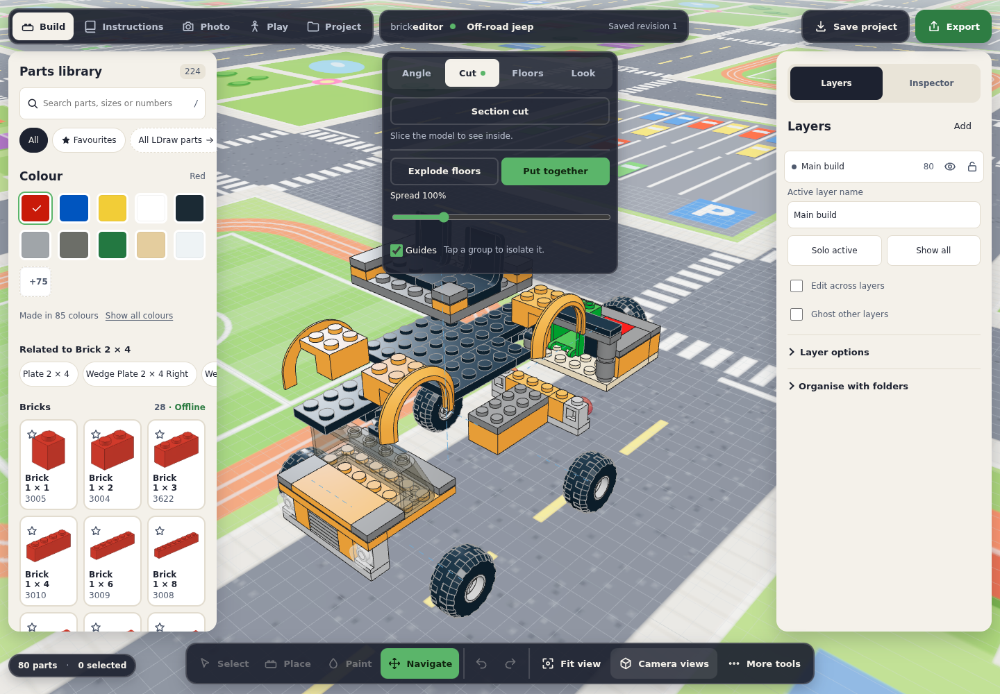
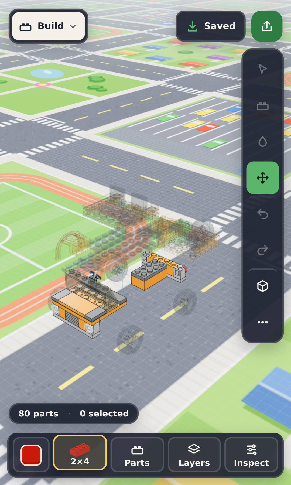
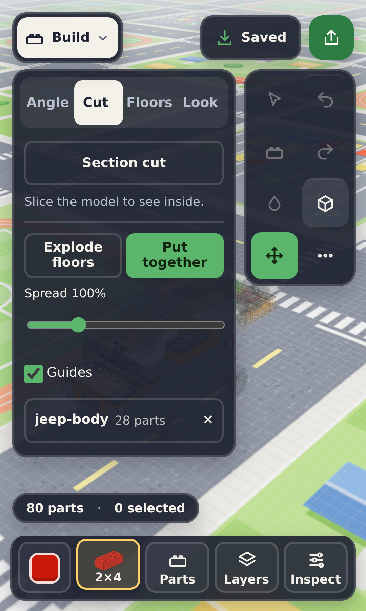

# Anatomy: exploded view by submodel

Anatomy takes a model apart along its own structure and puts it back together. The largest supporting part of the model stays where it is. Every other group slides out, one after another, in the direction where it comes free soonest. It is a view only: the document, its revision, undo history and exports do not change, and editing tools wait until the model is back together (like the floor explode).

The idea comes from Brickster's "Anatomy" moment (see `.local/reports/inspiration-study.md` §4). That code is proprietary; this is our own implementation, on our occurrence handles.

| Desktop                                                          | Phone (411 × 685, a wheel tapped)                                                | Phone pane (360 × 600)                                                                  |
| ---------------------------------------------------------------- | -------------------------------------------------------------------------------- | --------------------------------------------------------------------------------------- |
|  |  |  |

## Using it

- **UI:** _Camera views_ → _Cut_ → **Anatomy**. The same row holds **Explode floors**; only one exploded view is on at a time. While Anatomy is on, the pane shows a **Spread** slider (50–300 % of the travel that just clears) and a **Guides** checkbox (dashed lines from each group back to where it belongs). **Put together** animates everything home. Turning it on frames the model fully apart (keeping the viewing direction), and on phones closes the pane so the model can be seen coming apart.
- **Tap or click a group** while it is apart to isolate it: the other groups turn see-through, and the pane (and the status line) shows its name and part count. Tap it again, tap empty space, or tap the name chip to show every group again.
- **Play** puts the model back together at once (its world is built from the placed parts) and takes it apart again, animated, afterwards. Opening another model turns Anatomy off.
- **Automation:** `render.anatomy.set({ on?, spread?, guides?, focus?, animate? })` resolves when the animation has finished and returns the status; `render.anatomy.get()` returns it without changing anything. The status is `{ on, progress, spread, guides, focus, basis, movers, planMs, groups }`, where each group is `{ key, name, parts, role: "anchor" | "mover" | "stays", direction: "+x" | "-x" | "+z" | "-z" | "up" | null, distance, mirror }` (`distance` in LDU at the current spread; `mirror` is the partner's key). `animate: false` jumps to the end. A model with nothing to take apart returns `on: false, movers: 0`. Turning Anatomy on turns the floor explode off, and `render.explode.set({ gap > 0 })` turns Anatomy off.

## Groups

In order of preference:

1. **Top-level submodels** of the root model (an MPD's own structure). Parts placed directly in the root form one group, _Loose parts_. When one submodel wraps (nearly) the whole model — a root that only references `main.ldr` — the grouping looks one level inside it, up to six levels.
2. **Layers**, when the model has no usable submodels and at least two layers hold parts. Layers are how this editor organises flat builds, so they are the author's own sections.
3. **Touching clusters**: parts whose boxes touch or overlap (within 1 LDU) are joined (a spatial hash, near-linear); each connected cluster is a group, named _Section 1_, _Section 2_ … by size. This separates the independent objects of a flat file, such as a scene of separate vehicles.

Floors were considered and not used: floor detection itself needs submodels or layers to find levels, and the floor explode already covers lifting floors apart.

A group needs at least `min(6, ⌈parts / 150⌉)` parts to move (one part on small models, so a two-part wheel moves; six on large ones), and at most 16 groups move (the largest). Smaller groups stay with the anchor. A model with fewer than two such groups has nothing to take apart.

## Planning (`src/render/anatomy.ts`)

Everything is planned from part boxes in LDraw space (−Y is up). The renderer measures its drawn geometry: each prototype's local box (cached per prototype) placed by the occurrence's transform. `projectPartBoxes` does the same from the installed source bounds for tools and tests.

- **Anchor.** The model's base — a group resting on the model's bottom (within a plate) whose footprint covers at least 40 % of the model's — else the group with the most parts. The chassis of a car, the street under a café, the grounds of a castle.
- **Directions.** ±X, ±Z or up. Never down: that is the floor.
- **Clearance.** For a group and a direction, the travel is how far the group's box must move to pass every part box of the groups still in place that overlaps its cross-section and is not wholly behind it, plus a one-brick gap (24 LDU). Other groups' boxes prune first; only their parts are tested, so an L-shaped neighbour whose bounds cover the path but whose parts do not is no obstacle. Travel is at least 2 gaps plus a quarter of the group's size along the direction, so a free group still moves visibly.
- **Disassembly order.** Repeatedly, the unit (a group, or a mirror pair) that comes free with the least cost is taken out next; groups taken out no longer block the rest. The cost is the travel, plus 20 % per group already using that direction (spreading the groups around the model), plus how far a group already taken out would have to move on to make room, minus a small bonus for moving away from the model's centre. Travel results are cached and recomputed only when the group taken out lay in their path, so the plan stays cheap on large models.
- **Mirror pairs.** Two movers with the same part count, the same footprint inventory (an order-free hash of every part's sorted box size, so left/right mirrored parts match) and bounds that mirror each other about the model's centre plane x = cx or z = cz (within 2 % of the model's size) move as one unit: apart along the mirror axis (preferred on ties), or together up or along the other axis, always the same distance.
- **Settle.** A group taken out earlier ends further out than any later one it would overlap: it is pushed on along its own direction (pairs together) until no two moved groups overlap with the gap. Stacked groups keep their order — a roof ends above the upper floor above the ground floor.
- **Timeline.** Units leave in disassembly order, spread over the first half of the timeline; each moves over the other half with smoothstep easing. Putting together runs the timeline backwards, so the last group out is the first back in. The whole timeline takes 1.8 s; a very slow frame advances it by at most 200 ms, so the animation slows down rather than skipping.

On the samples: the jeep's body lifts off the chassis, the cockpit rises above it, the bed slides back and the wheels leave in mirrored pairs; the house's roof, upper floor and ground floor stack upwards in order; the station's trains slide off the track sideways.

## Rendering (`src/render/anatomy-view.ts`)

- Only occurrence handle translations change: each moved handle's matrix is set to its home translation plus its group's offset (home + offset, never accumulated, so putting together restores the exact placement). The batches refill their instance arrays (`refresh()`); nothing is classified or rebuilt, and no geometry is compiled. The same path the floor explode uses.
- Hidden-geometry culling depends on neighbours, so while anything is apart the batches draw full part geometry (as for the floor explode); back together, the plain view and its culling return because every translation is exactly home again.
- Animation frames count as motion: above the motion threshold, edges are hidden and phones draw at reduced pixel density until the view settles (see [rendering](RENDERING.md#frame-cost-on-large-models)).
- Isolation reuses the see-through layer treatment (instanced, no rebuild).
- Guides are one dashed `LineSegments` under the model root, drawn on top.
- Picking reads the handles, so a tap hits the part where it is drawn.

## Cost

Measured with `ANATOMY_PERF=1 npx playwright test anatomy-performance` (`tests/browser/anatomy-performance.spec.ts`): the 147,440-part plain-brick city (97 block submodels, `tests/helpers/brick-city.ts`) on the **mobile profile** (390 × 844, 3× device pixels), production bundle, headless Chromium on SwiftShader, on the shared 4-core ARM VM with a load average of 20–28 from other jobs. Milliseconds are VM wall time, not a phone frame rate; counts are exact.

| City, 147,440 parts, phone profile                             |                                    Measured |
| -------------------------------------------------------------- | ------------------------------------------: |
| Plan (occurrences, boxes, groups, directions), once            |               1.25 s (97 groups, 16 movers) |
| Of which planning proper (Node, same model)                    |                                     ≈ 50 ms |
| One animation step: write the moved handles' translations      |                                       25 ms |
| Refill of the batches after a step (the same as any refill)    |             470–650 ms (plain view: 600 ms) |
| Batch structures rebuilt                                       |                       0 (4 before, 4 after) |
| Document revision                                              |                                   unchanged |
| Triangles drawn, assembled (culled plain view)                 |                                      1.58 M |
| Triangles drawn, apart (full geometry, like the floor explode) |                                      13.9 M |
| Back together: plain view and culling                          | restored exactly (276,127 culled drawables) |

- Taking a model apart never rebuilds, recompiles or reclassifies anything; the per-step JavaScript is small (25 ms for 16 blocks of 1,520 parts on the loaded VM). A step's real cost is the batch refill, which is the same refill a floor explode, ghosting or instruction step does.
- The expensive part on a phone is what is drawn while apart: neighbour-dependent hidden-geometry culling is exact only with every part in place, so the view draws full geometry (9× here: 13.9 M instead of 1.58 M triangles, under the 24 M phone scene budget). The floor explode has the same cost. Keeping culling per rigid group (a stud covered by a part of its own group stays hidden) would need group-aware occlusion and is the next step if phones struggle.
- On SwiftShader the heavy frames arrive about every 15 s here, so the timeline's 200 ms step cap stretched the 1.8 s animation to 10 frames; on a phone GPU the same frames are far faster.
- On the samples (80–420 parts) the plan takes 2–40 ms in Node (unit tests) and is invisible in the browser.
