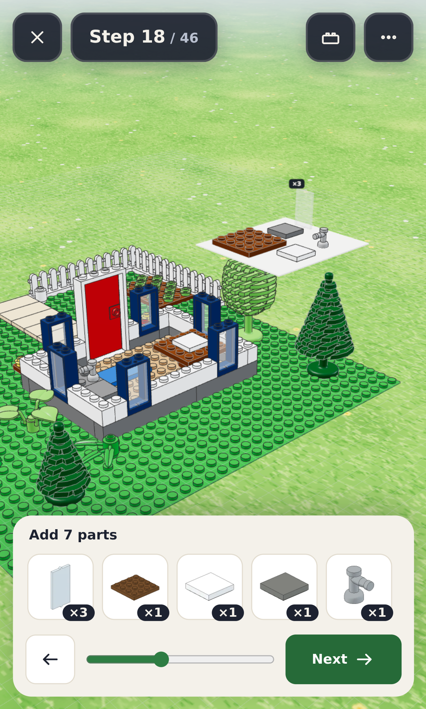
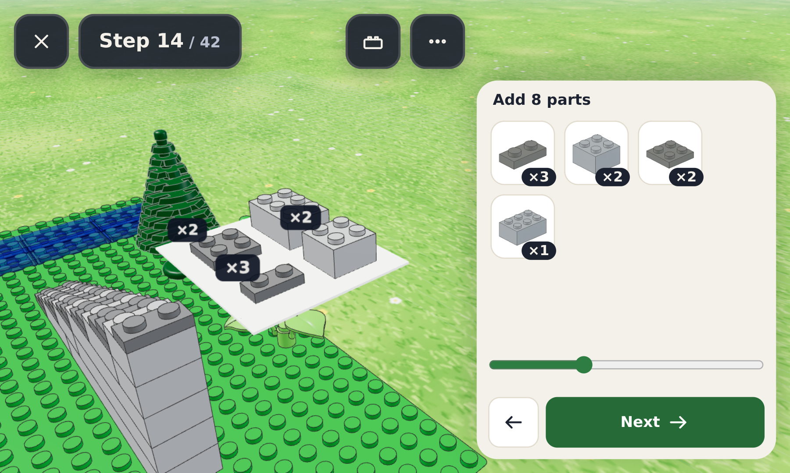
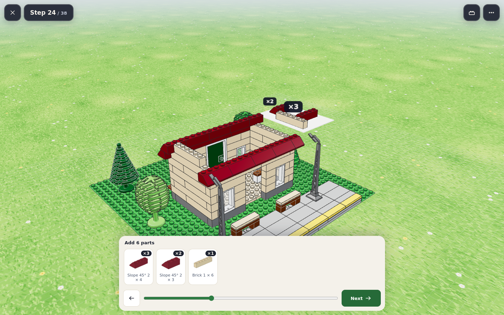
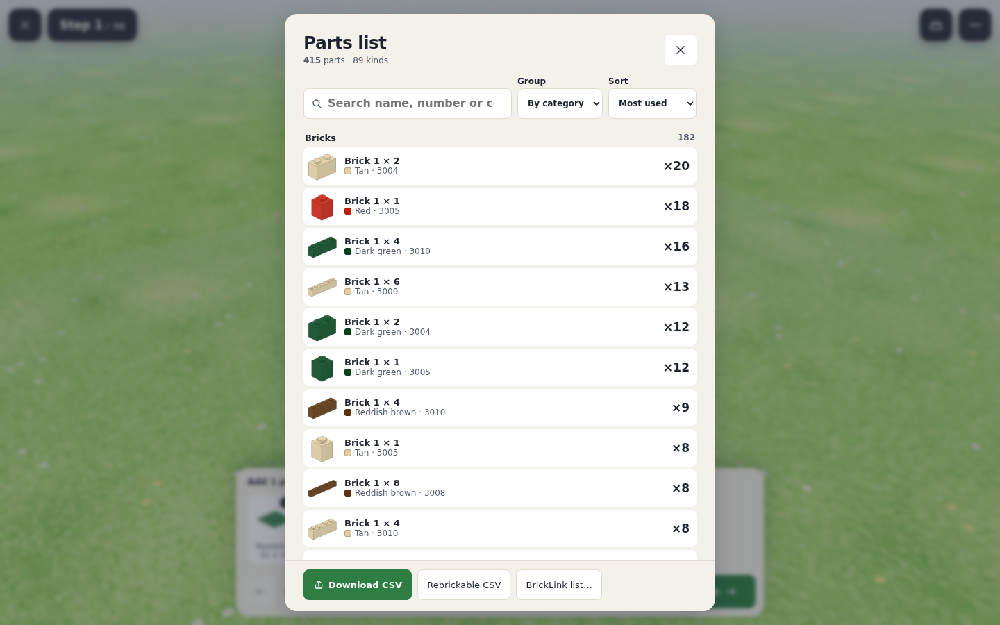
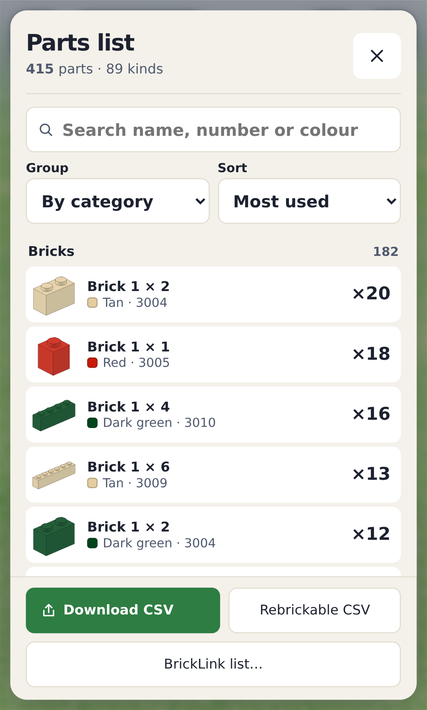

# Building instructions and the parts list

Two views of a loaded model that change nothing in it:

- **Build it step by step**: a follow-along viewer that shows one step at a time. Each step's new parts hop into place from a parts tray beside the model.
- **Parts list**: every part × colour in the model with its count, searchable and exportable.

The Instructions mode editor (organisational plans you author, publishing PNG/HTML/PDF) is separate and unchanged. Its plans can be followed in the viewer.

## Opening them

| Where                                    | What                                             |
| ---------------------------------------- | ------------------------------------------------ |
| Instructions mode card                   | **Build it step by step**, **Parts list**        |
| Export dialog (header **Export** button) | **Parts list**, **Build steps** shortcut cards   |
| Inside the step viewer                   | the parts-list key (top right) opens the list    |
| Parts list                               | **BrickLink list…** opens the Wanted List export |

The viewer covers the whole screen: the editor HUD steps aside and comes back when you close the viewer. Switching to Play or Photo closes it.

## Where the steps come from

`src/instructions/guide.ts` (`deriveGuide`) builds the step sequence from the model when the viewer opens. It is not stored in the project.

1. **The model's own steps.** If any model file splits its content with `0 STEP` / `0 ROTSTEP` lines, those steps are followed as written, in the main model and in every submodel. Official LDraw OMR sets, LPub, LeoCAD and Studio exports carry them. A file whose only STEP is a trailing one splits nothing, so it gets generated steps.
2. **Generated steps** for everything else: the built-in samples and custom builds. In each model, parts are ordered bottom up by the height they rest at (their lowest point, in whole plates). A layer is split into runs of at most 8 parts, taken in serpentine rows four studs deep so each run is a compact patch. A run smaller than 3 parts merges with its neighbour when the pair still fits 8. The unit tests check that every sample's steps average at least 3 parts and never exceed 12.
3. **Sub-assemblies.** A submodel placed more than once, or placed away from its parent's origin, is a real sub-assembly (a wheel set, a wing, a minifig). Its steps come first as a **callout**: it is built on its own from its first copy ("Sub-assembly 2/3", "Build 2 × wing"). The parent step then places every copy at once, shown in the parts strip as "×2 wing". A submodel placed once at the origin (a floor, a roof, a layer-like split, as in the house sample) is built in place: its steps are spliced into its parent's steps, in file order.
4. **Authored plans.** Plans saved in the project (Instructions mode) appear under **⋯ → Steps** and are followed as one flat sequence. The "Imported steps" plan made at import is not offered, because item 1 covers it and also follows submodels.

A one-part submodel counts as a part. Loose drawing primitives are placed with their step but are not listed as parts.

## The viewer

- **Top row:** close (Esc), "Step 12 / 48" (or "Sub-assembly 2/3"), the parts list and **⋯** options.
- **Panel:** "Add 5 parts" with a thumbnail for each part × colour the step needs and a ×count badge; placed sub-assemblies are the yellow cards. Under it: previous, a scrubber and **Next** (**Done** on the last step, which closes the viewer). On wide screens part names show under the thumbnails. On phones held sideways (landscape, at most 540 px tall) the panel becomes a column on the right.
- **Navigation:** Next/Previous buttons; ←/→, Page Up/Down and Space; Home/End; a quick horizontal flick on the model (under 320 ms, at least 70 px, mostly sideways; a slower drag still orbits); the scrubber. Only a single step forward animates. The scrubber waits for a 90 ms pause before redrawing, so dragging across a large model does not queue a redraw for every step.
- **View:** the model shows everything built so far in its normal colours. In a callout, only the sub-assembly is shown. Orbit and zoom work as usual. Each step moves the camera, keeping your viewing direction, to fit the new parts and the tray into the part of the screen the panels leave free.
- **Options (⋯):** which steps to follow (when there is a choice), **Show later parts faintly** (the rest of the current model or sub-assembly, see-through), **Parts tray beside the model**, and **Animate new parts**. Options are kept per browser (`localStorage` `brick-editor:guide-options`). The step you reached is remembered per project (`brick-editor:guide-step:<project>:<source>`).
- **Accessibility:** the step count is a live region, the scrubber reports "Step 3 of 12" or "Sub-assembly wing, step 2 of 3", and every part card has a label such as "2 × Brick 2 × 4, Red". All controls are at least 44 px tall.

## Fly-in and tray

`src/render/assembly.ts` (`AssemblyView`), driven by `SceneAdapter.showGuideStep()`:

- **Tray:** one copy of each part × colour of the step on a flat chalk "carpet". Parts keep the orientation they will be placed in, and repeated parts get a ×N tag. The tray sits beside the new parts, on the side facing the camera's right. It is raised above any shown part under its footprint, so it never sinks into the model.
- **Fly-in:** each new part hops from its tray spot along an arc into place. The arc is 30 + ¼ of the distance LDU high, eased in and out over 560 ms. Parts start 110 ms apart, and the whole stagger is held under 1.5 s. A placed sub-assembly drops in from above as one piece. Steps with more than 40 movers or 600 parts appear without a fly-in.
- **Cost:** the flyers and the tray are a few cloned part trees that share geometry and materials with the compiled parts. They cast no shadow and are not pickable. While parts fly, their own occurrence handles stay hidden, so the render batches keep drawing the previous step unchanged (and still culled). The batches classify once, when every flyer has landed. Animation frames only redraw; they refill and rebuild nothing, and the cached shadow map is kept.
- **Reduced motion:** with `prefers-reduced-motion: reduce`, or **Animate new parts** off, a step appears at once and the camera jumps instead of gliding. The tray still shows.

Automation and tests read `window.__brickScene.guideState` (`active`, `animating`, `shown`, `held`, `ghosted`, `tray`, `limited`). `finishGuideAnimation()` lands everything at once.

## Parts list

`src/inventory/parts-list.ts` (`partsList`) and `src/ui/PartsList.tsx`:

- One row per part × colour: thumbnail tinted in the colour (curated thumbnails, or the complete library's sprite sheets), name, colour swatch, colour name, part number and count. The header shows total parts and kinds.
- Group by category (default), by colour or not at all. Sort by most used, part number, name or colour. Search matches every word against number, name, colour and category ("red 1 x 2" finds "Brick 1 × 2", red).
- Custom parts defined in the model file are listed under "Custom parts", parts missing from the library under "Unknown parts". Loose drawing primitives are counted separately and not listed.
- **Download CSV:** `Part,Name,Category,LDraw colour,Colour,Quantity`, UTF-8 with a byte-order mark for spreadsheets. Cells starting with `=`, `+`, `-` or `@` are quoted as text. It exports the rows currently shown, so a search exports only its matches.
- **Rebrickable CSV:** `Part,Color,Quantity` in Rebrickable's parts-list import format, with Rebrickable colour ids. These come from the checked colour joins (`scripts/color-joins.json`, 154 of 322 LDraw colours have exactly one Rebrickable id; `src/catalog/color-names.json` is written from it by `scripts/build-color-names.ts`, and a unit test keeps the two in step). Part numbers use Rebrickable's number when the colour-availability pack records one, otherwise the LDraw number. Custom parts and colours without a checked id are left out, and their count is reported.
- **BrickLink:** the Wanted List XML stays in the export dialog ("Check your parts"). It maps every part to a BrickLink item and colour first, with decisions saved in the project.
- **Scale:** one pass over the occurrences builds the list; 150,000 parts list in well under a second (unit test). Rows render 150 at a time and more load as you scroll, so a model with thousands of kinds opens at once.

## Performance: step views are culled against what they show

Hidden-geometry culling ([PERFORMANCE-MINEBENCH.md](PERFORMANCE-MINEBENCH.md)) used to apply only when every part of the model was drawn, solid and in place. An instruction step, a floor focus, a hidden layer or a Play subset fell back to drawing every part whole. The 90 % step of the 148,960-part city drew 55.7 M triangles on the phone profile, against a 24 M budget.

Now (`src/render/batching.ts`, `hidden-view.ts`):

- Occlusion is computed among the parts drawn solid: visible and untreated. See-through parts (ghosted, dimmed) hide nothing and keep all their own geometry.
- The batches record each handle's draw state (hidden, solid, see-through) when they classify. The plain view applies whenever the current states match. When the states change (a step, a layer toggle, a floor focus, entering Play), the next draw classifies once more, if that pays: always in scenes of up to 20,000 handles, and in larger scenes only when the shown parts would draw more than a quarter of the scene budget whole (`batches.reclassifyPolicy`). Smaller views of large scenes are drawn whole. Moving parts (explode, the fly-in) do not reclassify. `batches.reclassifyOnView = false` restores the old refill-only behaviour. `render.budget().batches.reclassified` counts these classifications.
- **Budget-aware ghosting.** See-through parts cannot be culled. Ghosting, dimming, floor ghosting and "later parts faintly" are applied only when the triangles of the treated parts fit the profile's scene budget next to the solid view (`budget − usage.sceneTriangles`). Otherwise those parts are shown solid (dimming, layer and floor ghosting) or left hidden (later parts). The viewer's `guideState.limited` and a one-time status message say so.

### Measurements

The 148,960-part plain-brick city (`tests/helpers/brick-city.ts`, 98 city blocks of four block models) on the phone profile. Production bundle, SwiftShader, 4-core ARM VM. Triangle counts are exact. Times are not comparable between runs: other jobs on the shared VM kept the load average at 17–47 throughout.

`npm run test:stress -- --model city --parts 149000 --profiles mobile --no-play --interaction` (`showStep` with the last 10 % / 5 % new and the rest dimmed, as the Instructions mode editor does):

| City, phone profile          | Before                      | After                                  |
| ---------------------------- | --------------------------- | -------------------------------------- |
| 90 % step: triangles / lines | 55.7 M / 37.4 M (107 draws) | **8.48 M / 5.68 M** (77 draws)         |
| 95 % step: triangles / lines | 59.3 M / 39.8 M (111 draws) | **8.92 M / 5.97 M** (77 draws)         |
| Whole model, same camera     | 9.39 M / 6.28 M             | 9.39 M / 6.28 M                        |
| Dimming of the earlier 90 %  | drawn see-through, unculled | left out: over the budget, shown solid |
| Scene budget (phone)         | 24 M (17.3 M counted)       | unchanged                              |

The step viewer on the same city (`.local` script; 411 × 685 phone, profile `mobile`; the guide has 777 steps: 13 main steps placing 8 blocks each, and 4 block callouts of 191 steps):

| View                                      | Shown parts | Triangles drawn | Classified again            |
| ----------------------------------------- | ----------: | --------------: | --------------------------- |
| Callout, block-1 step 1                   |           8 |           3,930 | no (drawn whole: under 6 M) |
| Callout, step 126                         |       1,008 |         447,236 | no                          |
| Main step 9 of 13                         |     109,440 |          6.90 M | yes                         |
| Main step 13 of 13 (framed on new blocks) |     148,960 |          2.48 M | yes                         |
| Callout with later parts faintly (504)    |       1,016 |         285,186 | no                          |

- Deriving the guide takes 0.53 s in Node for 148,960 parts (unit test bound: 3 s). Opening the viewer on the city took 3.0 s under load, including the first step's view.
- Classifying again walks every batched handle: one occlusion pass (0.37 s for the city on a quiet VM, section 4 of PERFORMANCE-MINEBENCH) plus the batch structure. Under this VM's load, a main-sequence step of the city took 13–17 s to redraw, and a callout step 1.1–1.3 s. That is why a view whose shown parts would draw under a quarter of the scene budget whole (6 M triangles on phones, 15 M on desktop) is drawn whole instead (`reclassifyPolicy`). Scenes of up to 20,000 handles always classify again, which costs milliseconds.
- The fly-in costs nothing in the batches: during the animation the batches keep the previous step's classification, and each frame only redraws a few cloned parts. Phone-limit models still pay one classification per main step, when the parts land.

## Tests

- Unit: `tests/unit/instruction-guide.test.ts` (STEP lines and callouts, generated bottom-up steps and step sizes, compact runs, in-place submodels, every sample, authored plans, a 150,000-part guide under 3 s), `tests/unit/parts-list.test.ts` (counts through submodels, filters, groups, CSV and Rebrickable CSV, formula quoting, colour-name data in step with the joins, 150,000 parts), `tests/unit/hidden-batching.test.ts` (culling against the parts shown, reclassification counts).
- Browser: `tests/browser/instruction-viewer.spec.ts`: STEP model with a callout (step counts, callout titles, parts cards, keyboard, Escape, culling on in every step view); generated castle steps with fly-in, tray, scrubber and later-parts ghosting; reduced motion; layout without overlaps or HUD bleed-through at 360 × 600, 411 × 685 and 686 × 411, with 44 px targets, a touch flick and the options menu on screen; the parts list with totals, grouping, search and both CSV files.

## Screenshots

| Phone portrait                                                              | Phone landscape                                                                             |
| --------------------------------------------------------------------------- | ------------------------------------------------------------------------------------------- |
|  |  |

