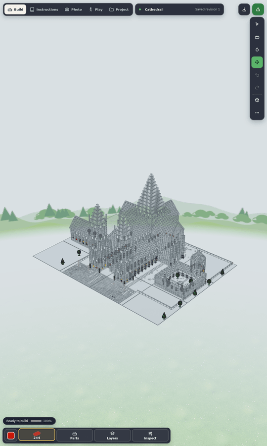

# Large builds on phones: what Minebench does, and what it means here

[Minebench](https://github.com/Ammaar-Alam/minebench) (spec reference S45, MIT code) shows two AI-generated voxel builds of 150,000–200,000 blocks side by side on a phone without lagging. This note records how it does that (studied at commit `master`, September 2026), which of its techniques carry over to LDraw parts, what was built here, and the measurements.

## 1. How Minebench draws 200,000 blocks

| Stage                | What Minebench does                                                                                                                                                                                                                                                                                                                                                                                                                                                                                                                                                      | Where                                                                                                         |
| -------------------- | ------------------------------------------------------------------------------------------------------------------------------------------------------------------------------------------------------------------------------------------------------------------------------------------------------------------------------------------------------------------------------------------------------------------------------------------------------------------------------------------------------------------------------------------------------------------------ | ------------------------------------------------------------------------------------------------------------- |
| Storage and transfer | The source JSON is kept only as the benchmark record. The viewer gets **MBV4**: a 16-byte header, a palette of block names, then `Uint16` x/y/z and a `Uint16` palette index per block — **8 bytes per block** (≈1.6 MB for 200,000 blocks), gzip on the wire (`DecompressionStream`), decoded straight into typed arrays. Builds of ≥ 150,000 blocks ship **MBF1** "mesh facts" instead: MBV4 plus one byte of visible-face mask per block and one byte of packed ambient occlusion per visible face, precomputed on the server. A ~3,000-block preview is shown first. | `lib/voxel/binaryBuild.ts`, `lib/voxel/meshFacts.ts`, `lib/arena/buildDeliveryPolicy.ts`, `buildArtifacts.ts` |
| Hidden-face culling  | A face is emitted only when its neighbour is empty or not an occluder; blocks with no visible face are dropped before meshing.                                                                                                                                                                                                                                                                                                                                                                                                                                           | `lib/voxel/ambientOcclusion.ts` `computeVisibleFaceMask`, `renderVisibility.ts`                               |
| Meshing              | **No greedy meshing** for normal builds: one quad (4 vertices, 6 indices) per visible face, AO baked into `Uint8` vertex colours. Narrow attributes: `Float32` positions, `Int8` normals, `Uint16` UVs, `Uint8` colours, `Uint32` indices (≈112 bytes per visible face). Greedy meshing and GPU-decoded quads exist only in a separate "large world" path (grids above 512).                                                                                                                                                                                             | `lib/voxel/mesh.worker.ts`, `meshBuckets.ts`, `worldRegionMesh.ts`                                            |
| Workers              | Builds above 8,000 blocks are meshed in a module worker; typed arrays are transferred both ways; mesh payloads are cached in IndexedDB (6 entries, 160 MB).                                                                                                                                                                                                                                                                                                                                                                                                              | `lib/voxel/mesh.ts`                                                                                           |
| Drawing              | **At most five meshes per build** (opaque, cutout, transparent, water, emissive), one texture atlas, vertex colours, Lambert materials, no shadows, no instancing, no LOD, no chunking (Three.js culls the whole build by its bounding sphere).                                                                                                                                                                                                                                                                                                                          | `lib/voxel/mesh.ts` `createVoxelGroupFromMeshPayload`                                                         |
| Frame policy         | Renders **on demand** (controls change, damping, resize). On phones: **pixel ratio capped at 1.5** ("cuts fragment work ~30% vs 2×"), **no MSAA**, `forceContextLoss` on unmount.                                                                                                                                                                                                                                                                                                                                                                                        | `components/voxel/VoxelViewer.tsx`                                                                            |

No triangle counts or phone frame rates are published. A 200,000-block build with walls one block thick shows about two faces per block, i.e. roughly 0.5–1 million triangles in five draws; a solid 60 × 60 × 55 block shows only its 21,600 surface faces (43,000 triangles). That — not a clever draw path — is why it is smooth: **almost nothing that cannot be seen is sent to the GPU**, and what is sent is drawn at a modest pixel density.

## 2. Why LDraw parts are different

A voxel is 12 triangles and nothing inside it. An LDraw part is a detailed model:

| Part                         | Triangles | Edge lines | Conditional lines | Studs | Closed shell (see below) |
| ---------------------------- | --------: | ---------: | ----------------: | ----: | ------------------------ |
| 3001 Brick 2 × 4             |       700 |        472 |               224 |     8 | yes                      |
| 3004 Brick 1 × 2             |       172 |        120 |                48 |     2 | yes                      |
| 3005 Brick 1 × 1             |        76 |         56 |                16 |     1 | yes                      |
| 3020 Plate 2 × 4             |       700 |        472 |               224 |     8 | yes                      |
| 3068b Tile 2 × 2 with groove |       178 |        100 |                32 |     0 | yes                      |
| 3062b Round brick 1 × 1      |       384 |        160 |                96 |     1 | no                       |
| 3039 Slope 45 2 × 2          |       352 |        164 |               107 |     2 | no                       |
| 3811 Baseplate 32 × 32       |    49,236 |     32,808 |            16,404 | 1,024 | no                       |

In a 2 × 4 brick, **384 of the 700 triangles are its studs and 298 its underside cavity** (tubes, inner walls, the underside of the top). Only 18 triangles are the outer box. In a wall, floor or solid block, almost every stud sits inside the part above it and almost every underside rests on the part below — the LDraw equivalent of Minebench's hidden faces, but 40 times larger per part.

## 3. What was built: hidden-geometry culling

Three modules and two small hooks (`src/render/hidden-geometry.ts`, `occlusion.ts`, `hidden-view.ts`; `RenderBatches.setVariantProvider` and a line in the adapter's budget check).

**Per part, once** (`hidden-geometry.ts`, cached per compiled geometry, shared by colour variants):

- Each triangle and line segment is classified: inside the cylinder of stud _i_ (radius 6, height 4 LDU above the verified stud connector, with margins for logos), or **inside the closed shell**. A part has a closed shell when its four sides and top are completely covered (sampled every LDU) by faces within 1.5 LDU of its bounding box — plain bricks, plates and tiles, including a tile's 1 LDU bottom groove; round, sloped, window and printed-top parts fail the test. Cavity primitives are those strictly inside that shell: they can only be seen through the open bottom.
- A **variant** leaves out a set of hidden primitives by building a new index over the original vertex attributes: the GPU buffers are shared, only the index is new (for lines too).

**Per model** (`occlusion.ts`, from placements and connector data, never from the camera):

- A **stud is hidden** when an anti-stud of another opaque part receives it (same lattice point, opposed axis). Transparent parts neither hide nor are culled.
- Closed-shell parts on the model's lattice fill a grid of 20 × 8 × 20 LDU cells. A part's **cavity is hidden** when every cell below it is filled by opaque closed-shell parts, its studs when every cell above is, and the **whole part** when every cell around all six faces is (Minebench's blocks with no visible face).
- Lookups are sorted `Float64Array`s of packed lattice keys, not maps of strings.

**Per frame** (`batching.ts`): the batches decide per refill which geometry each drawable draws:

| View                                                                | What is left out                                                                                                                                                                                                       |
| ------------------------------------------------------------------- | ---------------------------------------------------------------------------------------------------------------------------------------------------------------------------------------------------------------------- |
| Plain view: every part drawn, untreated, in place, no section plane | Hidden studs and cavities, enclosed parts, and cavities whose downward opening faces away from the eye                                                                                                                 |
| Steps, floor focus, hidden layers, Play subsets                     | Classified again among the parts drawn solid when it pays ([INSTRUCTIONS.md](INSTRUCTIONS.md#performance-step-views-are-culled-against-what-they-show)); see-through (ghosted, dimmed) parts keep their whole geometry |
| Explode and other moving parts (not reclassified)                   | Only cavities facing away from the eye, for untreated parts still in place (depends on the part alone)                                                                                                                 |
| Section cut                                                         | Nothing: the cut exposes insides                                                                                                                                                                                       |

A part's cavity opens downwards: an eye above the plane of its bottom cannot see into it. The distinct opening planes of a model are few (one per course level), the eye's side of each is checked every frame, and a change of side refills the instance arrays (no rebuild). Orthographic views use the view direction.

**Unchanged:** picking, box/lasso "through" selection, bounds, collision, connectors, Snap together and the path-traced Photo still read the full part geometry from the occurrence handles. The "visible" region selection ID pass draws what the batches draw, so a part enclosed on every side (which cannot be seen) cannot be picked by it either. Captures draw through the batches too: what is left out is inside neighbours or faces away from the capture camera, so images match (tested). `?hiddenCull=0` turns culling off.

## 4. Measurements

Method: `npm run test:stress -- --model city …` (the new plain-brick city, `tests/helpers/brick-city.ts`) and `--model village` (the 20,000-part architectural village), plus a short probe for the phone runs, on the production bundle in headless Chromium with SwiftShader on the shared 4-core ARM VM (load average 11–19 from other jobs during these runs). Desktop is 1440 × 1000; "phone" is the mobile resource profile at 390 × 844, 3× device pixels. "Base" is the same build with `?hiddenCull=0`. Triangle, line and draw counts are exact; milliseconds vary up to 3× between runs of the same build, and SwiftShader wall time is not a phone frame rate.

**The city** is 1,520 parts per block — a 2 × 4 plate base, a solid two-course 2 × 4 brick foundation, four 14 × 14 houses with 12 courses of 1 × N walls in running bond, a plate floor and a plate-and-tile roof — placed on a grid (16 blocks = 24,320 parts; 99 blocks = 150,480).

| City, 24,320 parts                            | Desktop base | Desktop culled |                       Phone base | Phone culled |
| --------------------------------------------- | -----------: | -------------: | -------------------------------: | -----------: |
| Scene triangles (budget count)                |   10,275,200 |  **2,818,816** |                       10,275,200 |    2,818,816 |
| Triangles drawn, orbit from above             |   10,275,200 |  **1,532,800** |                       6.5–7.1 M¹ | 1.28–1.45 M¹ |
| Edge + conditional line segments drawn        |   10,046,410 |      1,433,290 |                        5.0–5.3 M |  1.40–1.55 M |
| Draw calls                                    |           88 |            112 |                         480–560¹ |     680–780¹ |
| Frame CPU, median                             |       3.7 ms |         3.1 ms |                         15–32 ms |     11–17 ms |
| Reduced phone quality (> 4 M scene triangles) |            – |              – | yes (no conditional lines, 1.5×) |       **no** |
| Ready / first frame                           |  2.7 / 3.2 s |    3.0 / 3.5 s |                           11.0 s |  10.1–12.1 s |
| JS heap after load                            |        38 MB |          45 MB |                            37 MB |     43–46 MB |
| Occlusion (per classification)                |            – |          78 ms |                                – |       140 ms |

¹ Phone portrait views have much of the city outside the frame, so the adaptive culling cells are on: fewer triangles, more draws. A culled variant must save 16,384 primitives per bucket (4,096 per cell) to get a draw of its own; without the per-cell rule the phone drew 1,040–1,180 draws for 0.93–1.04 M triangles.

| City, 150,480 parts (147,440 on the phone) |                          Desktop base |       Desktop culled |                                               Phone culled |
| ------------------------------------------ | ------------------------------------: | -------------------: | ---------------------------------------------------------: |
| Scene triangles (budget count)             | 63,577,800: **refused** (budget 60 M) |       **17,441,424** | 17,089,072: refused at 16 M; drawn with a 24 M test budget |
| Triangles drawn, orbit from above          |                                     – |        **9,484,200** |                                                  6.3–6.8 M |
| Line segments drawn                        |                                     – |            8,553,802 |                                                  4.5–4.8 M |
| Draw calls                                 |                                     – |                  115 |                                                    780–870 |
| Frame CPU, median                          |                                     – |            8.4–11 ms |                                      8–42 ms (median ≈ 27) |
| Ready / first frame                        |                                     – | 11.6–12.9 s / 12.5 s |                                                    18–28 s |
| JS heap after load                         |                                     – |           162–164 MB |                                                     160 MB |
| Parts left out entirely (enclosed)         |                                     – |                8,316 |                                                      8,148 |
| Occlusion (per classification)             |                                     – |               382 ms |                                                     987 ms |

These two runs were measured on a local build with the limits that have since been adopted (desktop 200,000, phone 150,000, a 24 M phone scene budget); see [At the raised limits](#at-the-raised-limits).

| Village, 20,000 parts (desktop) |                    Base |                    Culled |
| ------------------------------- | ----------------------: | ------------------------: |
| Scene triangles (budget count)  |              10,701,930 |                10,006,246 |
| Triangles / lines drawn, orbit  | 10,701,930 / 10,148,765 | **7,839,208 / 8,093,245** |
| Draw calls                      |                     893 |                       942 |
| Frame CPU, median               |                   54 ms |                   38.5 ms |
| JS heap after load              |                   60 MB |                     69 MB |

The village is mostly windows, doors, arches, slopes, round parts and glass: studs on top of walls are covered, but few parts are closed-shell boxes, so it gains 27% rather than the city's 6.7×. Before substitutes had to pay for their draw, every distinct stud mask was a draw of its own and the village drew 4,148 draws (76.7 ms CPU) for 6.6 M triangles.

**Per part.** A covered 2 × 4 brick draws 18 of 700 triangles and 12 of 696 line segments; a 1 × 2 brick 18 of 172; a 2 × 2 tile 34 of 178 (unit tests). The 150,000-part solid-block occlusion micro-benchmark (1.2 million studs) takes 0.85–1.2 s on the loaded VM with a dense bit grid for the closed-shell cells; with sorted arrays and binary search it took 6 s.

**Images.** Culled and full captures of the city agree to 16 of 307,200 pixels with surfaces only (`tests/browser/hidden-geometry.spec.ts`). With edges, the full drawing also shows outlines of covered studs bleeding through the parts above them at a distance (depth precision), which culling removes: compare `docs/screenshots/hidden-geometry-edges-full.png` and `hidden-geometry-edges-culled.png`.

**Phone target.** A 150,000-part plain-brick city now fits the desktop budget with room to spare (17.4 M of 60 M) where it was refused, and loads on the phone profile when the occurrence limit allows it; seen from above the phone draws 6.3–6.8 M triangles in about 800 draws. That is still six times Minebench's estimated triangle count, because studs that nothing covers — every floor, courtyard and foundation top — are real, visible LDraw geometry. Section 5 lists what would close the rest of the gap.

### Budget changes

- **Made:** the scene-triangle budget counts what the plain view draws after culling (with every downward opening assumed in sight), not the sum of full parts. `render.budget().usage.sceneTrianglesFull` keeps the old figure. The 150,480-part city now passes the desktop budget (17.4 M) instead of being refused (63.6 M).
- **Made (30 September 2026):** occurrence limits desktop 200,000 / phone 150,000 (were 100,000 / 25,000) and the phone scene budget 24 M (was 16 M); the desktop scene budget stays 60 M, which a 199,120-part city (23.1 M) is well inside. The occurrence limit is now read from `resource-profile.ts` by `expansion-policy.ts`, the `document.ts` source ceilings, `scope.ts`, posed export, fill, the Play world profile and the generated schemas' list caps instead of being repeated. Derived expansion budgets scale with it (below). The earlier reservations still stand: non-plain views draw far more than the budget counts (measured below), and no physical phone has been measured.

### At the raised limits

Same method as section 4 (production bundle, SwiftShader, 4-core ARM VM, load average 3–10), `npm run test:stress -- --model city --no-play` with `--flat` for a one-model version of the same parts (every placement a line of the root model, so the project JSON, autosave and recovery carry every part).

| City at the ceiling               | Phone, 148,960 (98 blocks) |   Phone, flat 148,960 | Desktop, 199,120 (131 blocks) | Desktop, flat 199,120 |
| --------------------------------- | -------------------------: | --------------------: | ----------------------------: | --------------------: |
| Scene triangles (budget count)    |         17,265,248 of 24 M |    17,265,248 of 24 M |            23,079,056 of 60 M |    23,079,056 of 60 M |
| Triangles / lines drawn, orbit    |            6.56 M / 4.70 M |       6.56 M / 4.70 M |               12.5 M / 11.3 M |       12.5 M / 11.3 M |
| Draw calls, orbit                 |                        801 |                   801 |                           115 |                   115 |
| Frame CPU, orbit median (max)     |          10.3–11.8 (52) ms |          12.2 (46) ms |                   5.5 (15) ms |           4.4 (13) ms |
| Import / ready / first frame      |          0.3 / 8.7 / 9.4 s |   3.5 / 10.6 / 14.3 s |           0.4 / 14.4 / 15.3 s |  10.2 / 21.9 / 32.7 s |
| Longest long task to first frame  |                      1.9 s |                 2.7 s |                         3.9 s |                 4.6 s |
| JS heap after load                |                     162 MB |                226 MB |                        207 MB |                290 MB |
| Renderer + GPU process RSS        |                     644 MB |                969 MB |                        753 MB |                858 MB |
| Autosave, then recovery on reload |      saved; 10.2 s, 161 MB | saved; 10.9 s, 215 MB |         saved; 13.2 s, 205 MB | saved; 18.3 s, 275 MB |
| Occlusion (per classification)    |                     374 ms |                     – |                        905 ms |                     – |

- **Memory.** About 1.1 KB of JS heap per part for a city of submodels and 1.5 KB for a flat model, so the phone ceiling costs ≈ 160–230 MB of heap. Save and load hold in Node at the same sizes: the flat 148,960-part project is 35.0 MiB of project JSON plus a 6.5 MiB full LDraw copy (native zip 3.2 MiB, encode 5.7 s, decode 5.0 s); the flat 199,120-part one 47.4 + 8.8 MiB (zip 4.3 MiB). A phone could not reopen the first under the old 40 MiB decompressed-archive limit, so the phone's limit is now 64 MiB (desktop keeps 100 MiB, the native encoder's own cap). The flat LDraw files fit the import limits (6.5 of 10 MiB, 8.8 of 25 MiB). Checkpoints (64 Mi characters) hold the 47.4 MiB JSON.
- **Expansion budgets.** Leaves follow the occurrence limit; visited nodes 400,000 / 300,000 (a leaf plus its submodel levels), retained path-ID characters 128 / 64 Mi, generated 256 / 128 Mi and path slots 12.8 / 6.4 million. The 199,120-part city uses 3.0 M characters and 398,240 slots; these caps only bound hostile graphs.
- **Fixed at the ceiling:** "Detect floors" threw `RangeError: Maximum call stack size exceeded` on the 148,960-part city (`Math.max(...bottoms)`: V8 refuses to spread more than about 120,000 arguments). That spread and the others that can reach a whole model (`pointsBounds`, snap's box union, instruction-step merge/assign/remove, submodel record moves, progressive-load arrival lists) are now loops or `concat`; `tests/unit/large-models.test.ts` covers bounds of 200,000 points and floors of a 130,000-part model.
- **Non-plain views exceeded the phone budget (fixed).** The 90 % / 95 % instruction steps of the 148,960-part city on the phone profile drew 55.7 M and 59.3 M triangles (37–40 M line segments) in one frame, against 9.4 M for the plain view from the same camera: the step view did not cull against neighbours. Culling now runs against the parts a view shows (the batches classify again when the shown set changes), and see-through dimming or ghosting that would exceed the budget is left out: the same steps draw 8.5 M and 8.9 M triangles (5.7–6.0 M lines). Details: [INSTRUCTIONS.md](INSTRUCTIONS.md#performance-step-views-are-culled-against-what-they-show).

## 5. Techniques considered and not built

- **Chunked static merged meshes.** Minebench's five draws come from merging everything. Here, instancing already keeps the draw count at ~100 for the city (below); merging would give up per-occurrence refills (steps, ghosting, explode) and multiply memory by baking vertices per part. Per-region frustum culling exists as the adaptive cells of the handle rework.
- **Greedy merging of box faces.** After culling, an interior wall brick is 18 triangles; merging coplanar faces of neighbours saves little and would need per-chunk meshes.
- **Distance LOD / low-resolution primitives.** The complete library has 8-segment `8/` primitives (a stud becomes 24 triangles instead of 48). Exposed studs are now the largest remaining cost of plain builds, so compiling phone geometry with `8/` studs would roughly halve what remains; it changes authored geometry, so it needs its own quality setting and cache key. Proposed, not built.
- **Compact load format.** Minebench's MBV4 is 8 bytes per block. Here the 150,480-part city is 275 KB as an MPD (one submodel per city block, placed 99 times; the document keeps that structure). Flattened it is 6.98 MB of LDraw text (46 bytes per part; 533 KB gzipped), and the native project JSON is about 247 bytes per part (24.5 MB for 99,000 parts; 1.9 MB gzipped), with about 530 bytes of JS heap per part for the document alone. A binary placement table (part and colour palette indices, a rotation code and integer positions, ≈17 bytes per part) would cut autosave and recovery copies 15-fold; autosave serialization belongs to the concurrent long-task work, so this is proposed, not built.
- **Phone pixel density.** Minebench caps phones at 1.5× and turns off MSAA. Here the balanced profile allows 2× until a model passes the reduced-quality budget, and MSAA is always on; capping phones at 1.5× would cut fragment work about 44% on 3× screens. Proposed, not built (it changes every phone frame).

## 6. Loading skeleton

A large model used to show nothing until its first parts had compiled and been batched: 7–19 s for the 148,960-part city on the phone profile, and 10–18 s for the castle and the cathedral, even from the geometry cache. Before any part has compiled, a newly opened model (a template, an import, or a project recovered on reload) is now drawn as a **loading skeleton**: one translucent box per part, then replaced by the parts from the ground up. The technique is the one described for Brickster's viewer (translucent boxes at every part position, then parsed parts revealed bottom-up in chunks). It is reimplemented here on top of this renderer's workers, cache and progressive drawing (`src/render/load-skeleton.ts`).

- **Real bounds.** Each box is the part's build-time bounds (`bounds.json`, plus the complete pack's index for parts beyond the curated pack) carried through its placement, set a hair inside the part so neighbouring boxes read as separate parts. Project parts and raw faces use the same project bounds as stacking. Unknown parts get a 1 × 1 brick body. Mirrored placements keep outward-facing boxes.
- **Order.** The reveal order follows the model's instruction steps (the imported LDraw steps, else the first plan with two or more steps). Otherwise it goes from the ground up: largest LDraw Y of the box first, since −Y is up. It is one numeric sort of packed keys. Compile requests follow the same order (the variant of the first-revealed occurrence first), so the compile workers finish the ground floor first. A flush draws only arrived parts ranked below the number of parts arrived so far, so the roof copies of a brick that also appears on the ground floor wait for what is below them.
- **One draw.** The skeleton is one instanced draw of a 12-triangle box: three scaled axes and a centre per box, plus one rank float. Revealing a part rewrites its rank and uploads only the touched range. Boxes are ordered top down, so seen from above the upper boxes fill the depth buffer and the boxes below them are rejected before blending. Above 20,000 parts, parts are gathered into cells of a uniform grid sized so no more than 20,000 cells are occupied. Each cell is drawn as the box around its parts and hidden once all of them are drawn. The 148,960-part city draws 18,336 boxes in 97 LDU cells (220,000 triangles instead of 1.8 million).
- **When.** The skeleton appears 150 ms into a load that is still compiling, or as soon as it is planned for models of 4,000 parts or more, even from a warm cache, because placing and batching them alone takes seconds. A small cached load that finishes within 150 ms goes straight to its parts. Edits of the open model never show one, and `?skeleton=0` turns it off. When the UI asks to frame the new model, the camera fits the skeleton's bounds at once.
- **Motion.** Up to 40,000 parts, the boxes grow in upward over 700 ms with a 16 LDU rise. Larger models appear at once, and `prefers-reduced-motion` turns the growth off.
- **No added freezes.** While the skeleton is on screen, frames keep coming during a load. Each flush and the final swap therefore hold frames from the moment they place parts and change materials until their programs are warmed. A frame drawn in between would link every new program synchronously. Before this hold, two of five cold castle loads had a 1–7.7 s frame task; with it, the longest task matches `?skeleton=0`.

`render.compileStats().lastLoad` reports `firstPartsMs` and, when a skeleton was shown, `skeleton` (`instances`, `boxes`, `cell`, `shownMs`, `planMs`, `buildMs`, `revealedProgressively`, `bySteps`). `render.budget().skeleton` reports the skeleton on screen.

**Measurements.** All runs use the production bundle in headless Chromium with SwiftShader on the shared 4-core ARM VM, phone profile at 1080 × 1800. The load average was 16–44 from other jobs throughout, so totals vary by up to 2× between runs of the same build. Each comparison below is the same build with `?skeleton=0` against the default, run back to back. Cold is an empty geometry cache; warm is after a reload with every part cached. "First content" is the first drawn frame showing the skeleton or any part.

| Phone, 1080 × 1800                      | First content: off → on       | Full frame: off → on      | Longest task: off → on  |
| --------------------------------------- | ----------------------------- | ------------------------- | ----------------------- |
| Castle (237 parts), cold, 3 pairs       | 17.6–18.0 s → **0.64–0.87 s** | 17.6–18.0 s → 17.5–18.0 s | 270–397 ms → 324–428 ms |
| Castle, warm                            | 10.9 s → 8.7 s                | 10.9 s → 8.7 s            | 409 → 226 ms            |
| Cathedral (11,817 parts), cold, 2 pairs | 10.8–12.7 s → **2.7–3.8 s**   | 17.2–22.1 s → 22.6–23.8 s | 0.9–1.6 → 1.2–1.3 s     |
| Cathedral, warm, 2 pairs                | 9.8–10.6 s → **2.3–4.0 s**    | 10.6–14.6 s → 12.7–23.3 s | 1.1–1.2 → 0.9–1.5 s     |
| City (148,960 parts), cold, 4 pairs     | 14.2–22.4 s → **1.7–5.4 s**   | 25.5–35.7 s → 18.0–50.5 s | 3.7–7.1 → 3.5–9.9 s     |
| City, warm, 4 pairs                     | 5.4–24.6 s → **2.0–4.6 s**    | 12.0–47.0 s → 13.2–51.7 s | 3.3–11.1 → 3.4–13.7 s   |

City pairs are with the grid cap below; the last pair ran at a load average of 33–37 and is the slowest in every column. One pair at a load average above 40 is left out: every figure in it was 2–4× the others.

- **First content** comes 7–17 s sooner on large models, cold or warm, and the camera frames the whole model at that point instead of on its first parts.
- **Totals** are within the VM's noise for cold loads: the paired city differences have no consistent sign (−14 to +15 s), and the castle's match to a few hundred milliseconds. **Warm city loads were slower with the skeleton in all four pairs** (+1.2, +4.4, +7.2 and +4.7 s on totals of 12–52 s). `lastLoad.phases` puts the difference after every part is placed, in the final batch build, a phase whose single task varies by several seconds between runs of either build on this VM. It is not the skeleton's own work: planning took 0.24–0.76 s of wall time for the city, spread over short tasks (0.06–0.2 s for the cathedral), and building the draw 0.08–0.23 s in one task (8–41 ms for the cathedral). On a quiet machine, Node takes 140 ms and 110 ms for 150,000 parts (`tests/unit/load-skeleton.test.ts`). Whether this is noise or the skeleton's frames competing with the software rasterizer needs a quiet machine to settle (`?skeleton=0` is the switch to compare against). The longest tasks of a load (occlusion, placement, batching) are unchanged.
- **Before the grid cap**, the city drew all 148,960 boxes: about 1.8 M translucent triangles in every frame while it loaded. The cap bounds that cost on phone GPUs and on the software rasterizer.

Tests: `tests/unit/load-skeleton.test.ts` covers ground-up and step order, the lowest point against the origin, placement and fallback boxes, mirrored parts, abandoning, a generated city, the reveal rule, the instanced view and its partial uploads, and grid cells at 150,000 parts. `tests/browser/load-performance.spec.ts` opens the house on a 1080 × 1800 phone: the first frame showing anything shows all 281 boxes, parts replace boxes while the rest compile, and no skeleton is left at the end or shown for an edit. It also checks that `?skeleton=0` turns the skeleton off. `tests/browser/startup-recovery.spec.ts` checks that a 20,000-part recovery shows its skeleton.
