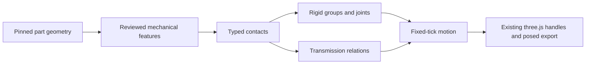

# Expanding Play motion and Technic mechanisms

Investigation: 3 October 2026, starting at `c004c82`, in worktree
`/home/ubuntu/brick-editor-physics-motion`, branch
`codex/physics-motion-investigation`. This is an investigation and proposed
implementation sequence. The initial investigation added no runtime capability;
implementation progress is recorded below.

**Implemented:** accumulated-turn dynamic position control now reaches and holds
the 720° probe target. Positive/negative turns, reversal, obstruction recovery,
rotated axes and loaded progress are covered by focused tests. See
[verification](PLAY-PHYSICS.md) and [the checkpoint](VERIFICATION.md#accumulated-turn-position-control-3-october-2026).
**Implemented foundation:** 15 source-bound mechanical profiles and typed
contacts now support read-only `mechanisms.propose()` drafts for retained shafts,
separate pin/arm articulations and complementary finger hinges with accessories.
**Implemented spur drive:** the reviewed 8:24 mesh now couples retained shafts
with one motor in preview, kinematic Play and Dynamic. Dynamic impulses reflect
output inertia and obstruction back to the input and return reaction to the
carrier. Unwrapped positioning, reversed/back-driven control, source isolation
and rendered accessories are covered by focused tests. See
[mechanical scope](PLAY-MECHANICAL-FEATURES.md). Rack transmission, direct
session-only Play entry, contact policy and the other phases remain open.

**Implemented controls:** session-only proportional motor input now drives,
reverses and brakes reviewed motors without changing authored presets or effort
bounds. Remote controls select one independent control, fold passive output
feedback, and automatically fit/orbit the whole rig in clear canvas space.
Closing restores the explorer view. Desktop and phone capture/interaction checks
and the bounded Impeccable finish review are recorded in
[verification](VERIFICATION.md#live-motor-controls-and-mechanism-overview-3-october-2026).

The strongest next step is a small mechanical feature pack and a transmission
layer on top of the existing rigid-group system. Brick Editor already has the
basic physics engine and moving renderer. What is missing is knowledge of which
parts move together, which connections allow motion, and how one motion drives
another. Turning every rendered brick into a physics body would exhaust the
current budgets without supplying that knowledge.

## What already works

| Capability                            | Current behavior                                                                                                     | Relevant implementation                                                                                                                      |
| ------------------------------------- | -------------------------------------------------------------------------------------------------------------------- | -------------------------------------------------------------------------------------------------------------------------------------------- |
| Authored hinge or axle                | Revolute joint; limits; continuous rotation when unbounded; position/velocity motors in Play                         | [Rig types](../src/mechanisms/types.ts), [kinematic evaluation](../src/mechanisms/kinematic.ts), [Play controller](../src/play/mechanism.ts) |
| Authored slider                       | Prismatic joint with scalar travel, limits and motors                                                                | Same controllers; travel is LDU                                                                                                              |
| Fixed attachment                      | Two groups keep their relative pose                                                                                  | Kinematic controller; Rapier fixed impulse joint in Dynamic                                                                                  |
| Ball joint                            | Preserves rest orientation in kinematic mode; rotates freely in Dynamic                                              | [Dynamic controller](../src/play/dynamics.ts); no authored orientation control or cone/twist limits                                          |
| Loose objects                         | Explicitly unanchored groups fall, collide and can be pushed by walking                                              | Dynamic controller; playground sample                                                                                                        |
| Vehicles                              | Authored planar driving with obstacle protection and optional driver seat; separate Dynamic ray-cast suspension mode | [Vehicle profile](PLAY-VEHICLES.md)                                                                                                          |
| Automatic movement in imported models | Pinned hinged door/window/shutter/gate/trapdoor leaves; trains on supported flat track                               | [Automatic doors](../src/play/auto-doors.ts), [trains](PLAY-TRAINS.md)                                                                       |
| Rendering and export                  | Session transforms move existing occurrence handles; explicit posed export; authored project stays unchanged         | [Renderer](../src/render/adapter.ts), [posed export](../src/mechanisms/posed-export.ts)                                                      |

An authored Technic crane arm can therefore already swing if its groups, pivot
and axis are supplied explicitly. Importing an ordinary Technic model does not
create those groups or joints, and turning its motor does not drive its gears.
The mechanism preview also differs from Play: authored motor metadata does not
automatically simulate forces or start a motor in `KinematicSession` alone.

## Findings and reproduced limitations

Run `npx tsx scripts/audit-play-motion.ts` from the repository root. The
[probe script](../scripts/audit-play-motion.ts) reads only committed packs and
original CC0 fixtures, allocates and disposes its own Rapier worlds, and performs
assertions before printing JSON. Its assertions characterize this checkpoint;
they should change when these limitations are addressed.

### 1. Rendered parts are not mechanical features

The pinned complete library has **1,367 Technic parts, 160 Hinge parts and 434
Train parts**. Its connector coverage marks 54 Technic parts verified and zero
Hinge parts verified. These are category counts, including variants and assembly
files, not counts of distinct working mechanisms.

The 54 verified Technic parts do not imply Technic connectivity support.
`ConnectorKind` only has `stud`, `antistud`, `pin`, `socket`; the latter two
represent door hinges. For example:

| Part                                | Current verified features | Missing mechanical interpretation                   |
| ----------------------------------- | ------------------------- | --------------------------------------------------- |
| 3700, Technic brick 1 × 2 with hole | Studs and anti-studs      | Round bearing through-hole                          |
| 3743, gear rack 1 × 4               | Anti-studs                | Rack pitch and pinion engagement                    |
| 3673 / 2780, plain / friction pins  | None                      | Pin shaft, collar, retention, rotational resistance |
| 3705 / 3713, axle / bush            | None                      | Keyed shaft, axle socket, axial stops               |
| 3648b / 4716, 24-tooth gear / worm  | None                      | Shaft attachment and motion ratio                   |
| 3315 / 3597, finger hinge pair      | None                      | Pivot, mating fingers and attached moving assembly  |
| 4623, bar plate                     | Studs and anti-studs      | Bar connection                                      |

See [connector format](../src/catalog/connector-pack.ts),
[extraction](../src/catalog/connector-extract.ts) and
[connectivity](../src/core/connectivity.ts). The current connectivity graph also
treats every recognized contact as ordinary adjacency. Its connected-selection
operation can traverse a door hinge; that graph cannot safely be reused as a
"weld all connected parts" operation.

The newer instruction code contains useful _source-reviewed landmarks_, including
six axle/bush profiles and the 3315/3597 and 3673/3700 Crane procedures. It expressly
does not certify motion, fit or insertion. Reuse the source review and hash-pinning
approach, then validate mechanical features independently:
[axial hints](../src/instructions/axial.ts),
[mechanism hints](../src/instructions/mechanism-procedures.ts).

### 2. General kinematic joints do not stop against the build

The probe puts a static box across the authored door's 90° pose. Play accepts the
angle, reports `blocked: false`, and the moved collider intersects that box.
`PlayMechanism.move()` checks the walking/seated actor; its general joint path
does not check static geometry or other mechanisms. Protected vehicle driving
has a separate world check. Automatic doors have a separate entry-time sweep
that derives allowable swing limits.

Thus authored crane arms, sliders and rotating sails can intersect walls or other
assemblies even though the actor is protected. Extending the same sweep policy
to the world needs supported contact allowances and work budgets, especially for
coaxial joints whose parts intentionally overlap at their connection.

### 3. Dynamic rigs have no internal contact response

Every body in a rig receives the same collision membership bit and excludes that
bit from its filter. Joint contacts are also disabled. The probe removes the
door's authored limits, drives it to approximately **180.077°**, and confirms
that its convex leaf collider intersects the fixed frame collider. It passes
through because the entire rig is exempt from internal collisions.

This is broader than disabling a joint's mating surfaces: it removes frame stops,
linkage interference and gear contact between all groups in that rig. A contact
policy must eventually distinguish allowed connector overlap from unwanted body
collision. Simply enabling all internal collisions would make current overlapping
proxies fight their own joints.

### 4. Moving hulls erase important mechanical geometry

The probe expands official 3700 geometry and feeds it through `proxyPoints()` and
the current convex-hull construction. The point **[0, 10, 0] LDU**, in its real
round through-hole, lies inside the resulting collider. Per-member hulls also
fill concavities and tooth gaps; point reduction can additionally shrink exposed
surfaces. The promise that reduction does not enlarge the _full convex hull_ is
not a promise that a hull matches the original non-convex part.

Use semantic joints for shaft/bearing engagement and simplified compound solids
for important collision openings. Tooth-by-tooth collision is a poor first gear
implementation. Rapier recommends compound convex decomposition for dynamic
non-convex solids rather than dynamic triangle meshes:
[collider guidance](https://rapier.rs/docs/user_guides/javascript/colliders/).

### 5. Closed linkages are rejected before reaching Rapier

`validateRig()` permits one parent per child and rejects cycles. Dynamic source
validation also creates a `KinematicSession`, so Dynamic has the same restriction.
The probe closes an otherwise valid two-body rig and receives
`Motion joint cycle.` This is a topology probe, not a working four-bar model.

It prevents representing closed four-bar linkages, crank/connecting-rod/piston
loops and many steering/suspension linkages. Rapier's impulse-joint approach can
close loops; the probe successfully creates a closing impulse joint. It does not
step that redundant graph or establish loop stability. The application validator
and tree pose evaluator are the immediate barriers, not a requirement to replace
the engine. See [Rapier's constraint explanation](https://www.rapier.rs/docs/user_guides/javascript/joint_constraints/).

### 6. Ball motor support needs runtime verification

The installed 0.21.0 declarations and exported `SphericalImpulseJoint` prototype
have per-axis motor methods. But `createImpulseJoint(JointData.spherical(...))`
returns type **6 (`Generic`)** in the Node probe, and that returned object has no
`configureMotorPosition` or `setMotorMaxForce` method. Casting it to the declared
spherical class does not fix this; calling the method throws a `TypeError`.

The probe records this discrepancy. Free ball rotation remains supported by the
app. Before proposing powered ball joints, verify the runtime wrapping behavior
and an upstream fix or a supported adapter. The same pinned engine successfully
creates spring, rope and generic joints, which the application's schema does not
expose. Generic degree-of-freedom support also does not establish convenient
per-axis motor/limit controls. [Rapier joint documentation](https://rapier.rs/docs/user_guides/javascript/joints/)
describes the wider engine functionality; the probe establishes the installed
package's behavior.

### 7. Multi-turn dynamic position targets (repaired)

Before the repair, in a fresh unbounded door rig without gravity, `setJointTarget("hinge", 720, 180)`
ends at approximately **9,127.104°**, reporting `blocked`, after 600 fixed ticks.
Separate one-off checks of 180° and 360° ended near those targets; this is not a
claim that every position target fails. Existing continuous _velocity_ motor
tests pass, which is a different contract.

The dynamic controller reported an unwrapped angle but passed its accumulating
position setpoint straight into the native motor. It now closes the position
loop in the accumulated coordinate with a bounded native velocity motor. The
same probe ends at **720°**, reporting `complete`, after 600 ticks. The selected
semantics follow every requested turn rather than choosing the shortest route.
Effort limits, obstruction recovery and settled completion remain physical.

### 8. Automatic doors move one leaf occurrence

The generated moving group contains exactly the door occurrence. The holder is
also one occurrence; separate accessories are not recruited. The probe adds a
separate nearby plate and confirms it remains outside the rig; this is not a
certified physical attachment fixture. By inspection, a separately modeled handle
or decoration attached to a moving leaf would likewise stay static without an
authored group. An accessory baked into the official leaf's geometry moves with it.

Likewise, an official complete assembly such as a universal joint or a contracted
linear actuator is one selectable part occurrence. Official subparts are compiled
inside it, not exposed as independently riggable document occurrences
([occurrence expansion](../src/core/document.ts)). Articulating such assets needs
a visual component map that retains the one inventory part, or explicit editable
decomposition with honest inventory semantics.

## Other movable parts that remain unsupported or incomplete

"Missing" here usually means no automatic recognition or mechanical behavior.
Several can already be animated through manual hinge/slider authoring.

| Family                                                    | What does not work automatically or physically today                                                                                                       | Proposed representation                                                                                           |
| --------------------------------------------------------- | ---------------------------------------------------------------------------------------------------------------------------------------------------------- | ----------------------------------------------------------------------------------------------------------------- |
| Brick/finger/click hinges, clip–bar pivots, turntables    | No general mating detection, moving-assembly ownership or detents                                                                                          | Reviewed feature pair → revolute joint; explicit limits and optional rotational resistance                        |
| Axles in round holes                                      | No bearing inference or axial retention                                                                                                                    | Cylindrical freedom initially; revolute only after axial restraint is established                                 |
| Keyed axle connections                                    | No shared shaft rotation or insertion-depth reasoning                                                                                                      | Rigid rotation coupling; axial freedom/retention represented separately                                           |
| Gears, bevel gears, worms, racks, differentials           | No transmission graph or ratios                                                                                                                            | Relations between shaft/slider coordinates; explicit engagement geometry                                          |
| Universal joints and CV joints                            | No linked multi-axis shaft motion; complete assemblies are frozen internally                                                                               | Component rig plus shaft relation; universal joint needs angle-dependent motion                                   |
| Ball/socket parts, towballs, articulated creatures/robots | No auto joints, pose controls, cone/twist limits or part-specific joint friction                                                                           | Spherical orientation state and bounded swing/twist; suitable collider proxies                                    |
| Shock absorbers and spring mechanisms                     | Vehicle ray-cast suspension exists; actual shock parts supply no spring/damper behavior                                                                    | Slider + spring/damper + travel stops                                                                             |
| Linear actuators, pistons and pneumatics                  | No screw/shaft-to-extension relation, valve/pressure model or composed assembly articulation                                                               | Slider plus screw coupling first; optional pressure actuator later                                                |
| Sliding/lifting doors, drawers, portcullises              | Excluded from the automatic hinge table                                                                                                                    | Reviewed guides/stops → prismatic groups                                                                          |
| Roller/sectional garage doors                             | Segments do not follow the bent rail path                                                                                                                  | Bounded segmented path follower; articulated dynamic chain later                                                  |
| Ropes, winches, chains, belts, tracks                     | Static authored geometry; no changing length, tension, pulley routing or drive relation                                                                    | Rope constraints and winch length; visual path plus simplified transmission; bounded link simulation where needed |
| Cranes, grippers and lifting platforms                    | No runtime grab/release attachment, carrying or actor support transfer                                                                                     | Explicit attachment lifecycle and support-body tracking                                                           |
| Trains                                                    | Initial car grouping/spacing works; no runtime coupling changes, wheel/rod animation, slopes, flexible/crossing/turntable track or build-obstacle checking | Extend existing rail/path system before treating a whole train as a free dynamic mechanism                        |
| Imported minifigures                                      | Explorer avatar animates its own configured limbs; ordinary model figures do not become articulated/playable                                               | Reviewed figure component profiles, inventory-preserving visuals                                                  |
| Breakable/clutch connections                              | No strength or separation model                                                                                                                            | Optional declared simulation thresholds; no claim of measured LEGO clutch strength                                |

The explorer can stand on dynamic colliders but is not transported by a support
body and is not pushed by moving bodies. Train riding attaches the figure to the
cab as a special case; it does not allow walking around a moving carriage. Dynamic
vehicles offer remote driving, not the authored seated-driving path. These gaps
affect lifts, ferries, rotating platforms and vehicles as much as Technic itself.

## Suggested implementation sequence

The proposed pipeline keeps the current simulation and renderer:

### A. Mechanical features and a small working Technic scene

Start with a reviewed set of plain/friction pins, round holes, axles, keyed holes,
bushes, two spur gears, a rack, and one finger hinge or turntable pair. Extend
feature encoding and verification per feature rather than making a stud-valid
whole part imply all its other connections are valid.

Record local frame/axis, shaft interval, bore depth/radius, key phase, insertion
range, stops, allowed degrees of freedom, and provenance. Primitive placements
such as `connect`, `confric`, `peghole`, `connhole` and axle-hole families can seed
extraction; part-specific reviewed exceptions remain necessary. LDraw's
[primitive reference](https://wiki.ldraw.org/wiki/Primitives_Reference) supplies
these geometric conventions, including local hole-axis and scaling rules. It
does not supply a ready mechanical simulation graph.

Match features by collinearity **and overlapping engagement intervals**, compatible
cross section and keyed phase; matching centers/opposed normals alone is
insufficient. Preserve rounded OMR transforms through `nearlyPhysical` and exact
simulation frames. Keep mirrors/scales explicitly unsupported until appropriate
physical proxies exist. Inspect custom/embedded official copies conservatively.

Build a typed contact graph. Collapse verified rigid attachments into groups;
retain articulation and transmission edges. A friction pin resists rotation but
is not automatically a weld. A keyed axle locks relative rotation but may slide
until collars/bushes restrain it. Multiple coaxial bearings must reduce to the
same shaft support rather than introduce redundant joints. Authored ownership
wins, unknown contacts remain unknown, and ambiguous proposals show their reason.

Generate session rigs first, with an explicit preview/save action for authored
rigs. Extend selection and placement through the same feature data. Do not silently
turn a whole submodel or every touching part into one rigid body.

**First acceptance scene:** motor → 8-tooth/24-tooth gears → output shaft, plus a
separate pin-hinged arm. Check 3:1 speed, opposite spin under declared axis signs,
rotated/nested models, rigid accessories following their shaft, invalid engagement
refusals, repeatable replay, posed export and unchanged project/inventory.

### B. Explicit transmission relations

Add a transmission relation type separate from the joint that attaches each
shaft to its frame. The smallest useful deterministic version solves a spur pair
as `zA × thetaA + zB × thetaB = phase` for consistently oriented external gears.
Rack travel uses `x = pitchRadius × theta` with radians and LDU. Preserve unwrapped
shaft coordinates internally; folding only one shaft by a full turn can lose the
phase of a downstream non-integer ratio.

Repair and verify multi-turn dynamic position control before relying on it in
transmissions or winding mechanisms; continuous velocity spin alone does not
establish correct accumulated-turn positioning.

For kinematic Play, drive one coordinate and derive the others, with atomic
collision acceptance for the connected mechanism. Validate relation cycles,
conflicting drivers and incompatible ratios. A second independent motor on each
gear is not a transmission: it supplies extra power and fails to transmit load.

For Dynamic, prototype coupled constraints or a bounded impulse solver, including
inertia, effort limits and load reaction. The current exposed schema contains no
gear constraint. Do not claim that copying motor target speeds conserves energy.
Worm backdriving/self-locking, backlash, differential behavior and slipping
clutches need separate semantics and validation after the first spur/rack slice.

### C. Contact policy and closed mechanism graphs

Introduce allowed contact pairs/features and important compound collision proxies.
Keep intentional bearing engagement separate from frame stops and arm interference.
Add bounded world sweeps for kinematic joint motion and contact response for
non-mating bodies inside dynamic rigs.

Retain the existing tree evaluator for simple kinematic rigs. A versioned graph
or explicit loop-closure list can extend the schema for Dynamic without allowing
recursion cycles in that evaluator. Validate coincident anchors, compatible axes,
anchoring, group ownership and redundant constraints independently from tree
traversal. Kinematic closed loops need a dedicated solve or an explicit unsupported
result; dropping a closure would silently change the mechanism.

**Acceptance scenes:** four-bar, slider-crank, steering linkage. Measure closure
error, limit overshoot, motor stall, singular/dead-center behavior and stability
over long replay. Test rotated group frames. Then extend compound authoring UI;
the current editor supports only one joint/two groups or its basic vehicle layout.

### D. Additional joint and actuator families

Expose spring/rope data and cylindrical freedom, each with appropriate validation,
reports and paused preview behavior. Springs need rest length, stiffness and
damping; sliders also need travel limits. Rope needs slack/tension and attachment
points; winches need changing length and a visual cable. Resolve the spherical
runtime discrepancy before adding powered orientation control, then design proper
multi-axis pose and swing/twist limits rather than reusing a scalar hinge slider.

Add joint friction/detents separately from surface friction. Current idle joint
motors apply a generic 2 N·m or 5 N holding resistance; these are simulation
defaults, not a plain-pin/friction-pin distinction. Model actuator torque/force
at the existing **0.02 m/LDU gameplay scale**, not miniature real-world hardware
ratings without a declared conversion.

Add live session motor speed/target input and reversal. `play.setMotor` currently
only enables/disables an authored target; `setJointTarget` supplies position
travel, not a live velocity-motor throttle. Map simple buttons and levers onto
these inputs before adding more elaborate electrical or pneumatic systems. This
would let an authored crane, conveyor, lift or fairground ride be controlled in
Play while retaining its saved rest pose and authored default settings.

### E. Shared support and interaction behavior

Track the actor's support body and local contact point. Apply platform translation
and rotation through the normal capsule sweep, handle jumping/detachment, and
inherit point velocity deliberately. Integrate dynamic seats with the actual
chassis frame, safe entry/exit and collision exclusions. Add reversible grab/release
attachments for cranes and grippers. A simple lift or rotating platform can be
implemented alongside the early Technic scene and gives an immediate Play benefit.

### F. Keep large builds cheap

Stay with bodies per rigid assembly. Existing budgets are 32 active rigs, 128
groups and 200,000 moving triangles; Dynamic adds 14 rigs, 64 bodies, 512 dynamic
members and 256 hull points. Rendering permits many more static parts than
physics does. Collision bits currently encode rig identity, so revised filtering
also needs to preserve these bounds or replace that allocation scheme.

Moving occurrences are materialized outside static batches. Measure draw calls,
moving triangles, main-thread tick cost, heap and entry latency, not only rigid
body count. Preserve part-local culling; do not reuse rest-pose neighbor occlusion
after an assembly opens. Derive/cache reviewed features and proxies against the
library hashes, cap discovery and solver work, keep the engine lazy and offline,
and report refused/ambiguous mechanisms. Any worker simulation proposal should
include transform-transfer and render-interpolation measurements first.

### G. Contextual Play controls and mechanism overview

Additional user direction, 3 October 2026: use the impeccable design skill as
functionality grows, preserving the established navy HUD/chalk sheet system.
Link Technic motors and useful articulated parts to simple in-game controls.
Offer touch sticks/levers and equivalent keyboard/pointer input; avoid adding
permanent panels or controls that currently cannot do anything. Only show a
mechanism's drive controls while it is active, and show coupled passive outputs
as feedback rather than duplicate competing motor controls. Release, pointer
cancel, focus loss, pause and exit must stop held input reliably.

The user chose **automatically fitting and orbiting the whole active mechanism
in third person** while its controls are active. This overview must frame the
whole connected system, retain live motion, allow orbit/zoom and return to the
explorer's view on leaving controls. Larger assemblies should be understandable
without steering the explorer around to see every shaft. Walking/vehicle/train
controls should appear only in the modes where their input can be used.

Live session motor speed/reversal input is a prerequisite (phase D), with authored
defaults and effort caps preserved. Direct proposal entry/review/save should
connect the reviewed contact graph to this control flow. Keep labels plain,
targets at least 44 CSS px, the canvas dominant and safe areas clear. Verify the
mechanism/no-mechanism/paused/blocked/vehicle/train cases and keyboard, pointer
and touch release behavior. Inspect desktop 1440×1000 and the required portrait
and landscape phone/tablet sizes in a bounded, batched impeccable review.

## Verification scope

This section records the **initial investigation**, before the implementation
checkpoints above. Current implementation evidence is in [VERIFICATION](VERIFICATION.md).

- Nine focused existing Vitest files passed: **102 tests** covering mechanisms,
  joint authoring, dynamic bodies/motors/vehicles, moving colliders, doors,
  connectors and track/trains.
- The read-only audit passed all assertions, including hole filling, static
  obstacle overlap, internal frame overlap, rejected cycles, frozen kinematic
  balls, multi-turn position overshoot and the spherical runtime API discrepancy.
- TypeScript checks and formatting are recorded in [VERIFICATION](VERIFICATION.md).
- No new browser or hardware experiment was run. The geometry probes use existing
  three.js fixture compilation helpers, not a live rendering screenshot. There is
  no validated dynamic transmission, stable closed linkage, complete-library
  auto-rig coverage figure or phone performance claim in this investigation.
