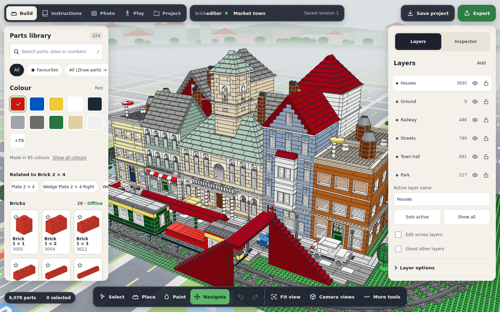

# Sample builds

Project → **Start from a template** shows picture cards for twelve sample builds and a blank canvas: three big scenes of thousands of parts written as [build scripts](AGENT-BUILDING.md) (market town, cathedral, harbour) first, then nine smaller detailed builds. Each sample is an original build made from official LDraw parts, and each shows off something in Play. **Explore the corner café** on the empty-canvas welcome card opens the café.

| Sample            |  Parts | Designs | Outside the curated catalogue                                                                                                                                        | Play                                                                                                                                                                            |
| ----------------- | -----: | ------: | -------------------------------------------------------------------------------------------------------------------------------------------------------------------- | ------------------------------------------------------------------------------------------------------------------------------------------------------------------------------- |
| Market town       |  6,083 |     104 | track (53401, 53400), train bases (92088), bogies (2878c01), cab front (2924bc01), train windows (4033c01, 4035c01), Big Ben clock brick (3003p0b), lampposts (2039) | cross the railway on the footbridge, walk in through the town hall's portico door and the shop doors; press **Go** and the train runs round the town ([trains](PLAY-TRAINS.md)) |
| Cathedral         | 11,817 |      68 | pointed arches (13965), 75° spire corners (3685), lampposts (2039)                                                                                                   | in at the west door, up the aisle past the pews and up the stairs to the organ gallery; the transept, cloister and palace doors open                                            |
| Harbour           |  6,966 |      89 | sails (u9494c01, 85651c01), rowing boats (2551), barrels (2489), 75° spire corners (3685), lampposts (2039)                                                          | up the steps from the water onto the quay, along the quay and the jetty, into the warehouses, the harbour houses, the chapel and the lighthouse                                 |
| Corner café       |    358 |      56 | Lamppost (723), bicycle (4719c01), "Café" sign (3010p20), menu board (2454adfa), cup tile (3068bp25)                                                                 | open the shop door, walk in, climb the stairs to the room upstairs and go out onto the roof terrace                                                                             |
| Windmill farm     |    338 |      40 | cows (64452p01, 64452p02), pig (87621p01), chicken (95342)                                                                                                           | the sails turn on a motor (rig `windmill`); walk into the barn and the mill through doors that open                                                                             |
| Lighthouse        |    269 |      42 | rowing boat (2551)                                                                                                                                                   | the lamp turns on a motor (rig `lighthouse`); climb the steps from the beach to the top; the cottage door opens                                                                 |
| Off-road jeep     |     80 |      32 | windscreen (4176), mudguards (50745), wheel rims (6014b), balloon tyres (56890)                                                                                      | sit in the driver seat (E or tap **Get in**) and drive: vehicle rig `jeep`, front-wheel steering, faces −Z                                                                      |
| House with garden |    281 |      43 | none                                                                                                                                                                 | walk up the path, open the real door (E or tap) and go in                                                                                                                       |
| Small castle      |    237 |      39 | none                                                                                                                                                                 | cross the drawbridge and walk under the gate; climb to the wall walk; raise the drawbridge (rig `drawbridge`)                                                                   |
| Roadster car      |     58 |      22 | none                                                                                                                                                                 | sit in the driver seat (E or tap **Get in**) and drive: vehicle rig `car`, front-wheel steering, faces −Z                                                                       |
| Playground park   |    110 |      23 | none                                                                                                                                                                 | Play starts with dynamic physics: push crates and barrels, swing the swing, tip the see-saw, spin the roundabout                                                                |
| Railway station   |    415 |      49 | track (53401, 53400), 9V switch (75542-f1), train bases (92088), bogies (2878c01), cab front (2924bc01), train windows (4033c01, 4035c01), lamppost (723)            | press **Go** and the train runs round the oval; throw the points to send it into the siding; ride along ([trains](PLAY-TRAINS.md))                                              |

The older technical starts (studio `room`, `wall`, `200`, exploration room `explore`, door and vehicle `mechanisms`, open-bench `seated-vehicle`, `door-room` and physics playground `physics`) are no longer offered in the chooser. They stay available to automation (`project.import({format:'template', template})`) and the CLI as test fixtures; the unit and browser suites use them.

Each sample opens on a backdrop that suits it ([rendering](RENDERING.md#backdrops)): the market town, jeep, roadster and café on the toy street map, the cathedral, house, castle, windmill farm, playground and railway station on the meadow, the harbour and lighthouse on the beach (`TEMPLATE_BACKDROPS` in `src/catalog/templates.ts`, saved in `project.scene`). The chooser cards stay on white.

## How they are made

### The build-script samples

The market town, cathedral and harbour are [build scripts](AGENT-BUILDING.md) written the way the [build agent prompt](../prompts/build-agent.md) asks an agent to work — plan the site, massing, openings, roofs, details, then compile, read the report, render views from several sides and iterate — and they were the test of that tooling (see [what changed](#what-building-them-changed)). The scripts are `fixtures/build-scripts/market-town.json`, `cathedral.json` and `harbour.json`; `npm run templates` compiles them into `fixtures/ldraw/templates/market-town.mpd`, `cathedral.mpd` and `harbour.mpd`, runs the same checks as the other samples and renders their cards. `src/catalog/script-templates.ts` names them; the app fetches their LDraw text on demand (`src/catalog/script-template-urls.ts`: Vite emits each file as a hashed asset, so the offline snapshot precaches it) and opens it with one layer per script section (read back from a `0 // Build script layer:` line in each section file; the biggest layer is the default layer, so a project stays within the schema's 10,000 layer assignments). `tests/unit/template-script-samples.test.ts` compiles each script again and requires the committed file to match.

- **Market town** (street map). A block of eleven town houses back to back between two streets, from four components recoloured per copy with `palette`: shop houses with arched windows and striped awnings over their shop windows and a balcony railing, tall houses with a street gable, a bay window and a chimney, corner houses with side windows (`with: ["left"]`/`["right"]`), a roof terrace, a water tower and a parasol, and hotels with a canopy on columns and balconies on every floor. In the middle of the high street a tan town hall with arched windows, a portico of columns with a balustrade and a clock tower (Big Ben clock bricks, a belfry of arches and a hip roof). Roads with dashed centre lines and seven parked cars (4600 plates with `wheels`), pavements with lamp posts, trees and benches, a park with a pond, paths and a bandstand at one end, a square with a fountain at the other. Round it all an oval of official track (`track`, 24 pieces) with a station platform and shelter on the front straight, a footbridge over the rails (stairs of two plates a step up to a deck 34 plates high, clear of the train) and a train of a locomotive and a coach (`railcar`). The ground floors have floors, counters and furniture, and their doors open in Play.
- **Cathedral** (meadow). A Gothic cathedral on a paved square: twin west towers with lancets in three tiers, an open belfry, corner buttresses with pinnacles and 75° spires (`pitch: 75`); a west portal with a porch of columns and a rose window of stained glass; a nave with an arcade of arches (6183) between nave and aisles, clerestory lancets and a gable roof in sand green; aisles under lean-to roofs (`style: "shed"`) with buttresses between their windows; a transept with triple lancets and doors, a crossing tower with a spire, and a choir with tall lancets and an altar. Every window is a pointed arch (13965) over a one-stud slot of stained glass (trans red, dark blue, yellow and light blue bricks mixed per brick). Inside: a black-and-white tiled floor, pews, and a west gallery with organ pipes up a flight of stairs (two plates per step). Beside it a cloister round a garden with a well, a round chapter house with a stepped conical roof, and the bishop's palace; lawns with trees and flowers inside a railing. The towers and aisles are written once and `mirror`ed.
- **Harbour** (beach). A stone quay six plates above a blue sea (blue baseplates with ripples), bollards and lamp posts along its edge; a row of seven tall harbour houses in bright colours with gables (one component, `with: ["tall"]` adds a storey) and a second row of twelve across a cobbled street; two brick warehouses with loading doors, arches and hoist beams; fish stalls, crates, barrels, a harbour crane and a fish market hall on columns; a chapel with a steeple. In the water a tall ship with three masts and sails (`anchor: "origin"`), sailing boats, fishing boats, rowing boats by a wooden jetty, steps (a plate a step) from the water up to the quay, and a breakwater out to a red-and-white lighthouse with a gallery and a lantern.

Screenshots in the app, desktop and a 1080 × 1800 phone, editor and Play: market town [desktop](screenshots/samples/town-desktop.png), [phone](screenshots/samples/town-phone.png), [Play](screenshots/samples/town-desktop-play.png), [Play on the phone](screenshots/samples/town-phone-play.png); cathedral [desktop](screenshots/samples/cathedral-desktop.png), [phone](screenshots/samples/cathedral-phone.png), [Play inside](screenshots/samples/cathedral-desktop-play.png), [Play on the phone](screenshots/samples/cathedral-phone-play.png); harbour [desktop](screenshots/samples/harbour-desktop.png), [phone](screenshots/samples/harbour-phone.png), [Play on the quay](screenshots/samples/harbour-desktop-play.png), [Play on the phone](screenshots/samples/harbour-phone-play.png).

### The code-generated samples

Each build is generated by code in `src/catalog/builds/` (`cafe.ts`, `windmill.ts`, `lighthouse.ts`, `jeep.ts`, `house.ts`, `castle.ts`, `car.ts`, `playground.ts`, `train.ts`) with a small kit (`kit.ts`):

- **Grid placement.** A part is placed by the stud cell of its footprint's corner and the plate level it rests on (LDraw −Y is up, one plate is 8 LDU, a brick 24). The kit reads each part's footprint, origin phase and underside from the catalogue, so every part lands on the stud grid whatever its own origin.
- **Walls.** Rings and straight walls are laid course by course in running bond: each run is split into 1 × N (or 2 × N) bricks so that no joint lines up with a joint in the course below, preferring long bricks; corners interlock by alternating which wall runs through them. Openings leave room for window and door frames.
- **Roofs, doors and windows.** `gableRoof` lays a 45° roof of stepped slope courses (each clutching the row below in running bond) with gable walls and a ridge of double slopes; `door` hangs a Door 1 × 4 × 6 on a Door Frame 1 × 4 × 6 on either face; `glazed` puts the glass in a window frame.
- **Sections.** Each build is a multi-part MPD with one submodel per section (walls, roof, interior, stairs…). A section can have its own placement: the windmill's sails are built flat and stood up in front of the cap.
- **Corner café.** A road with a dashed centre line, a pavement with parasol tables (a 2 × 2 round brick, a jumper, a pole of round bricks and an inverted 4 × 4 dish), lampposts and a bicycle, and a corner garden. The 18 × 12 café has a tan ground floor with dark green window frames, a "Café" sign over a panelled door (60623) that opens out over the pavement, a counter with a coffee machine and a menu board, tables with coffee-cup tiles, and stairs along the back wall: ten steps of two plates each over a one-stud tread and a last step of one plate onto the first floor, under an open stairwell with a railing. Upstairs, a white room with a door out to a roof terrace under a red-and-white striped awning of 33° slopes, with parasol tables and flower boxes, and a dark red 45° roof.
- **Windmill farm.** A stone base with a door, a white tower with windows, a dark red cap and four lattice sails (reddish-brown frames covered in grille tiles) in a pinwheel on two 2 × 16 spars. The sails' hub (a 2 × 2 round plate) sits with one row of anti-studs on the two side studs of a 1 × 2 brick (11211) at the tip of a shaft brick, so the whole farm is one stud-connected build; the rig turns the sails about the hub's centre. A red barn with two doors that open inwards, hay bales, a pasture with a spindled fence, cows, a pig and a trough, a vegetable field with lettuce and carrot rows, chickens, trees and paths.
- **Lighthouse.** A rocky island of three brick tiers, each inset two studs, with 45° slopes round the rims, grass on top, a sandy beach, a jetty and a rowing boat in a blue sea. Stone steps climb the front: two plates per step, the last one plate. The lighthouse is ten Round Bricks 4 × 4 in red and white bands, a gallery with lattice railings and four posts, a lamp (trans-yellow round bricks and clear headlight bricks on a round 4 × 4 plate on a pedestal) and a cone roof with a mast. The keeper's cottage has a door that opens outwards, windows, a bed and a table.
- **Off-road jeep.** Six wide, to minifigure proportions: two Minifig Seats 2 × 2 a stud apart in a doorless cockpit (a seated minifigure's arms reach past its seat, so a small console sits between them), the sills two plates above the floor (below the seated arms), the steering wheel on the dashboard row over the front axle, clear of the seated legs, a windscreen, a roll bar at the front of the load bed (behind the seats' row, so nothing is overhead when a figure climbs in), cargo and a spare wheel on the tailgate. Chassis: two Plate 2 × 2 with Wheel Holders (4600) under a plate spine and Car Mudguards 4 × 2.5 × 2 (50745) over Wheel Rims 12 × 11 (6014b) with balloon Tyres 12/61 × 11 (56890). The tyres clear the ground by 2.9 LDU, which keeps the body on the plate grid. The rig's driver seat puts the minifigure's hips 18 LDU above the driver's cushion, clear of the seat's front studs and arms; the approach and the exits are two and a half studs out from each side.
- **House.** 14 × 10 studs on a 32 × 32 baseplate: foundation course, white walls, dark blue window frames with glass, a Door Frame 1 × 4 × 6 (60596) with a Door 1 × 4 × 6 (60616a) on its hinge pins, floor plates inside, a tan band at the first floor, a 45° gable roof with a chimney, and a fenced garden with a path, flower beds, potted flowers, a vegetable patch, a fruit tree, pines, a pond with lily pads, a bench and a mailbox. The door opens outwards over the lawn; the path stops short of its swing.
- **Castle.** 2-stud-thick grey walls with an occasional darker stone, four round towers (Round Brick 4 × 4) with cones, jumpers, flagpoles and flags, crenellations and a tiled wall walk, a gate under Arch 1 × 6 × 2 with a raised crest, a moat, a drawbridge (a 4 × 6 plate hinged at the wall face), a courtyard path, a well, barrels, a timber hall with a lean-to roof and a staircase of 16 plate-high steps up to the left wall walk.
- **Playground park** (`playground.ts`). A 32 × 32 baseplate with a paved plaza of 2 × 4 tiles, four crates (two 2 × 2 or 2 × 4 bricks with a tile lid) and two barrels (two round bricks 2 × 2 with a round tile) standing loose on the tiles, a see-saw (a 2 × 10 plank with seats and handles on a 2 × 2 post), a roundabout (a 6 × 6 plate with four handle posts and a cone on a round post), a swing (a 1 × 4 seat hanging on two upside-down antennas under a beam on round-brick posts), a small ramp of 33° slopes, trees, flowers, a bench and a fence. Every moving thing is its own rig: six single-group loose rigs (`crate-1`…`crate-4`, `barrel-1`, `barrel-2`, `anchored: false`, 4–8 kg) and three revolute rigs (`seesaw` ±15°, `roundabout` unlimited about Y, `swing` ±70°). All nine set `dynamics.startDynamic`, so Play starts with Dynamic physics chosen, and the project carries the Play hint “Push the crates and barrels, then swing!”. 9 dynamic rigs and 12 bodies, inside Play's 14-rig and 64-body limits. The loose objects stand on smooth tiles so they slide instead of catching on studs. In Kinematic Play the joints still move with the contextual action and the loose objects stay put.
- **Railway station** (`train.ts`). An oval of plastic track (six-stud-wide Straights 53401 and R40 Curves 53400, sleepers standing on the ground, rail tops 24 LDU up) with a 9V left switch (75542-f1) on the near straight: its diverging route and a curve back lead to a siding inside the oval that ends after one straight. The track is laid by `placeTrackPiece` from the pinned centreline table, so every joint meets exactly (written to six decimals). On a 32 × 32 baseplate beside the near straight, a platform three plates high (the explorer steps straight up) with 2 × 4 tiles, a yellow edge, two benches and lampposts, and a small tan station building with a 45° gable roof, a door to the forecourt (it opens outwards), an open doorway onto the platform, a ticket counter, flower beds and trees. The train: a red locomotive (a Train Base 6 × 24, 92088, on two Train Wheel Bogies 2878c01, a cab with train windows 4033c01 and a Train Front 2924bc01 with headlights, and a hood), a green passenger coach with windows and seats, and an open goods wagon with crates and barrels, 16 LDU apart on the near straight. Play derives the train (loco first) and runs it ([trains](PLAY-TRAINS.md)); the project carries the Play hint “Press Go to start the train, then switch the points!”.
- **Roadster.** A four-wide speedster to minifigure proportions. Two Plate 2 × 2 with 2 Wheel Pins under Car Mudguards 2 × 4 (wheelbase 8 studs), a black plate chassis, Wheel Rims 6.4 × 8 with Tyres 6/50 × 8, headlight bricks with clear 1 × 1 round tiles on their recessed side studs, a grille, curved slopes over the nose and tail, a windscreen, a steering wheel, red tail lights and an open cockpit: the Minifig Seat 2 × 2 sits two studs behind the steering wheel (clear of a seated figure's legs) with an open row behind its reclined backrest, and the sills are two plates high, so the seated figure's hips fit between them and its arms rest over them. The rig's driver seat puts the hips 18 LDU above the cushion, as in the jeep; the approach and exits are four and a half studs out from each side.

`npm run templates` writes the sources to `fixtures/ldraw/templates/*.mpd`, checks them, and renders the chooser previews (`public/templates/*.webp`, 320 × 240) with the app's renderer; `-- --check` skips the previews. `tests/unit/template-builds.test.ts` and `tests/unit/template-samples.test.ts` keep the committed sources identical to the generators.

## Checks

`src/catalog/builds/check.ts` compares every pair of parts by their derived occupancy boxes (for parts outside the curated pack, the same derivation is run on the complete library's geometry), checks grid placement and counts verified connections. Every sample reports no overlapping bodies, every part on the stud grid, and all parts with verified connectors in one stud-connected group (café 334 with 4 hinge pins, windmill 313 with 6, lighthouse 264 with 2, jeep 61, house 263 with 2, castle 223, car 44, playground 94, railway station 371; the rest are decor, glass, animals, trees and parts without verified connector data).

The overlap check exempts parts that nest by design: glass in its frame, a door leaf on its frame's pins, a door frame's hinge collars (they sit in the part above like studs), a flag's clips round its pole, and the cars' wheel assemblies (a rim on its wheel pin, a tyre on its rim, both under the mudguard's arch, whose round clearance is finer than the occupancy cells). Track pieces interlock at their joined ends and train wheels run inside the rail heads, so neither counts; track curves and rail vehicles are off the stud grid by design.

The in-app **Model health** check uses the same derived occupancy for catalogue parts, ignores glass in its own frame and parts joined by a verified connection. It reports the café, windmill farm, lighthouse and house clean; for the jeep and roadster it reports the wheels on their pins and tyres under the mudguards (wheel pins are not a modelled connection family), and says so in the detail text.

Loose objects are free-standing by design: a connected group whose parts all belong to one rig group marked loose (`dynamics.groups[id].anchored === false`) is left out of the build check's group count and of Model health's connection and separate-group checks, which say how many loose objects they set aside (the playground's six crates and barrels and its swing seat). Rail vehicles are set aside the same way: a group with no track part that touches a train wheel or bogie stands on its wheels on the track (the railway station's three cars).

## Offline

The build-script samples' LDraw files (1.1 MB of text, 0.1 MB compressed) are bundle assets and are precached like the rest of the app. The house, castle and roadster need only the curated pack. The other samples use a few parts from the complete library: the offline snapshot (service worker) precaches the pack index, the 61 chunks those parts need and their 29 derived-connector shards (5.0 MB in all, 2.4 MB of it the index; the three build-script samples added 31 chunks and 15 shards), so every sample opens offline once the app is installed for offline use.

## Play fit

The Play figure is an LDraw minifig: 104 LDU tall with its hair, a 24 LDU wide collider (hips and hanging arms are wider). The house door opening is 68 LDU wide and 128 LDU high; the gate is 80 LDU wide and 120 LDU high under the arch's springing (the arch now stands on the wall top, raising the gatehouse crest; 237 parts). Unit tests also walk the figure across the drawbridge and under the arch. The house floor and path are one plate high and the castle stairs rise one plate per one-stud tread, within the figure's step height. Unit tests walk the figure into the house through the opened door and up the stairs onto the castle wall walk; a browser test drives the roadster and opens the house door with E.

Doors are standard Door Frames 1 × 4 × 6: an opening 68 LDU wide and 128 LDU high, room for a minifigure. Stairs rise at most two plates (16 LDU) per one-stud tread (the castle's one plate), well within the Play figure's step height; the café's stairwell is open above the whole flight. Unit tests (`tests/unit/template-samples.test.ts`) open the café door, walk in and climb the stairs to the room upstairs; climb the lighthouse steps from the beach to the top and watch the lamp turn; watch the windmill's sails turn and walk into the barn through its opened door; and put the figure in the jeep's driver seat, drive off and get out. `tests/unit/template-builds.test.ts` walks into the house and up the castle stairs. Browser tests open every sample strictly, drive the jeep from its seat, watch the windmill's sails turn and open the house door with E.

The railway station's train is tested in `tests/unit/play-train-template.test.ts` (round the oval, into the siding once the points are set, stopped at its end, waiting while the explorer stands on the track) and `tests/browser/play-trains.spec.ts` (Go, the switch, reverse and ride along on desktop and a phone held sideways).

The build-script samples are walked in `tests/unit/template-script-samples.test.ts`, over the part of each build around the walk (a Play session over thousands of parts' collision meshes is built only where the figure goes): over the town's footbridge from the fields, along its deck above the rails and down into the town, and in through the town hall door (the town's 24 track pieces join with no gaps or dead ends, and its locomotive leads a coach); in at the cathedral's west door and up the stairs to the organ gallery; up the harbour steps from the water onto the quay, and along the quay into a warehouse. Every door in them derives a Play rig (19 in the town, 5 in the cathedral, 23 in the harbour, within Play's 32). `tests/browser/script-samples.spec.ts` opens all three strictly on a desktop and on a 1080 × 1800 phone (the phone profile) with clean health, and presses **Go** in the town.

## Load and frame time

Measured on the ARM64 VM with SwiftShader (software WebGL, so these are CPU numbers, far slower than a phone's GPU), the production build, a fresh browser context each time (no geometry cache), `project.import({format: "template"})` until `ready({strict: true})`, then the median of 15 frames orbiting the camera. Phone: 412 × 686 CSS px at DPR 2.625 (1080 × 1800), which selects the phone profile.

| Sample      | Profile |  Parts | Part/colour variants | Scene triangles (drawn / before culling) |     Load (ms) | Moving frame (ms) | Draw calls |
| ----------- | ------- | -----: | -------------------: | ---------------------------------------- | ------------: | ----------------: | ---------: |
| Market town | phone   |  6,083 |                  411 | 3.40 M / 4.93 M                          | 8,000–16,000¹ |                49 |      1,311 |
| Market town | desktop |  6,083 |                  411 | 3.40 M / 4.93 M                          |         6,600 |                38 |      1,311 |
| Cathedral   | phone   | 11,817 |                  197 | 3.16 M / 6.58 M                          |         9,400 |                18 |        599 |
| Cathedral   | desktop | 11,817 |                  197 | 3.16 M / 6.58 M                          |         8,600 |                15 |        644 |
| Harbour     | phone   |  6,966 |                  376 | 3.16 M / 6.94 M                          |         8,500 |                39 |      1,125 |
| Harbour     | desktop |  6,966 |                  376 | 3.16 M / 6.94 M                          |         7,800 |                30 |      1,152 |

¹ The first open after starting the browser (13–16 s) pays for loading the complete library's index and part chunks from disk; opening it again in a fresh page took 8.0 s. Loading includes fetching the LDraw text, importing it, compiling the parts' geometry in workers (the part/colour variants) and drawing. The town has the fewest parts but the most variants and draw calls (eleven house palettes), which is what its load and frame time follow; the cathedral, twice its size in parts, is mostly one stone colour.

The old phone limit was 25,000 occurrences and 16 M scene triangles: all three are well within it (the town, the phone-safe one, uses a quarter of the occurrences). Frames are drawn on demand, so a still view costs nothing; moving frames are what the table shows.
