# LEGO construction and surface experiment

This study compares the six current gallery briefs with experimental prompting and visual revision, using **GPT-6.1-Sol and GPT-6-Astra, high**. The initial twelve trials are followed by six concept-preserving E revisions. The paired E/F follow-up tests revisions from source alone, preserving the text-only spatial reasoning challenge; the latest comparison reruns identical E inputs with Astra. The first two E runs respond to the owner’s preference for the original temple and Ewok compositions; the other four complete the gallery comparison. Worktree branch: `codex/lego-generation-study`, based on `origin/main` at `579d0f7`. Nothing is published to the gallery.

The original creative prompt encourages a scene for every subject, calls a freestanding subject a losing pattern, defines ground as the baseplate top, asks to keep builds inside baseplates and tells models to leave flat roofs studded. The runner also inserts a cottage-on-a-baseplate JavaScript example. Those are concrete sources of bias; simply appending “no baseplate” leaves contradictory instructions and examples. The early A/B trials corrected the main coordinate/finish rules and example but retained the legacy scene workflow. The final C prompt removes that contradiction too; exact filled input snapshots are saved per build.

## Variants

- **Original:** unchanged 7 October gallery builds, from [the creative prompt comparison](../creative-prompt-comparison/README.md).
- **A — object and surface rules:** keep the creative prompt's concept planning, part search and draft checks, but make freestanding assemblies the default; permit separate coherent accessories; use compact local supports only when needed; deliberately finish the visible skin with tiles/slopes/curves and retain purposeful studs. Use a compact plate-built cottage example rather than the scenery slab.
- **B — studied construction:** A plus concrete construction lessons from five public LDraw models, and an internal plan for silhouette, contact footprint, skin zones and actual available shaping parts. Warn that tiled staircases still have stepped silhouettes.
- **C — finished workflow and visual revision:** remove the remaining legacy “scene: a baseplate…” workflow and mandatory story/props from B; teach structure → shaped shell → focal details, including a zone-by-zone surface audit. Give B's accepted source and its rendered views to the same model in a fresh call, ask it to inspect and improve the actual result, and retain both versions. C changes both the workflow and the feedback process and has a larger compute budget than A/B; it is not an isolated image-input ablation. The other four gallery briefs test this finished prompt from scratch without input images.

- **D — visual references from scratch:** the finished C workflow and two official Creator bird renders, with instructions to borrow construction/surface techniques while preserving the requested species, palette and anatomy. No earlier generated source is supplied. This checks whether reference-led generation can avoid anchoring on a flawed draft. It is exploratory, not a controlled comparison isolating image input.
- **E — concept-preserving construction revision:** general construction principles and a distinction between composition and support, applied to each original gallery source with its three rendered views. Preserve its meaningful components, arrangement, palette and interactions while revising construction. No named-set recipes or per-build repair guidance. See [E results](#remaining-gallery-builds-with-e).
- **E with Astra high:** rerun byte-identical text-only E inputs with `gpt-6-astra`, changing only the model. See [Astra results](#e-with-astra-6-high).
- **E text-only control / F economical construction:** identical original source and generic revision request, no images. F separates intent from geometry, prefers replacement over covering layers, removes architectural recipes and uses a syntax-only example, with separate revision audits. See [text-only results](#text-only-ef-comparison).

The original gallery targets and brief text are preserved: pelican 800, Piplup 1,000, dragon 1,000, temple 2,000, Ewok Classic Space 3,000 and Star Destroyer 5,000. A/B share search, three compiler draft checks per attempt, up to five repair attempts, pinned parts/colours, cameras, look and resolution. The generator gets no shell, browser or other agent tools. `project_doc_max_bytes=0` prevents repository instructions leaking into trials inside a worktree. Initial trials with repository context were discarded and are not part of the comparison. Session context confirms `gpt-6.1-sol` and `high`.

## Results and previews

Open [the local comparison viewer](index.html) to switch between front, back and three-quarter views. Sources, compiler reports, exact filled prompts and accepted MPDs are beside each new build. The PNG sheets below show the variants together; each camera fits its whole model, so apparent image size is not a shared physical scale.

All completed new builds omit baseplate parts. This does **not** ban bases: the temple has plate-built foundations, the spacecraft has a compact cradle and bicycles use a small stand. Exposed studs are reduced through deliberate shaped assemblies rather than simply covering every surface in tiles.

### Pelican: D is my visual pick

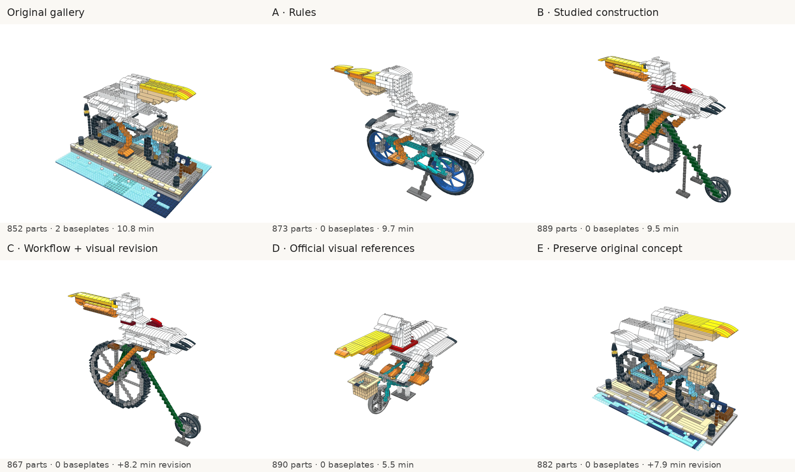

A removes the waterside platform and chooses real bicycle wheels, but its bird still looks like a stack of terraces with disconnected curved decorations. B gives the body and bill a more coherent skin, yet spends 257 parts on the wheel section and produces a blocky penny-farthing. C improves the tapered wings and back, but inherits that wheel and adds another 8.2 minutes after B's 9.5 minutes. D combines a smoother bird with actual integral-tyre wheel parts; its wheel/support section takes 19 parts, and the entire generation takes 5.5 minutes. Its broad bill and hanging wings read well in the three-quarter view. The head/neck junction and frame still need refinement. D is my preferred **render**, not a certified physical model.

### Piplup: revision can damage silhouette

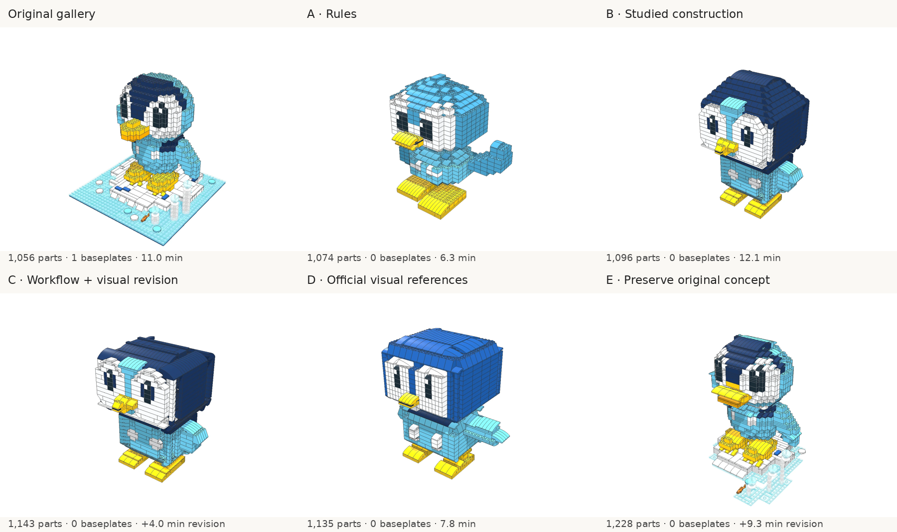

A removes the ice display but keeps conspicuous crown/foot studs and a stepped outline. B makes the navy hood and feet much more deliberate; it is a clear surface improvement without losing the rounded crown as much as C. C tiles and smooths the crown but flattens it into a squarer head, and worsens connectivity diagnostics. The larger compute budget did not make it my preferred result. D has shaped wings and a smooth cap but returns to a particularly square head, with a flatter blue palette and broad white eye panels. **B is my Piplup pick.** Reference images help with some assembly choices; they are not a guarantee of better anatomy.

### Other gallery briefs: fresh finished prompt

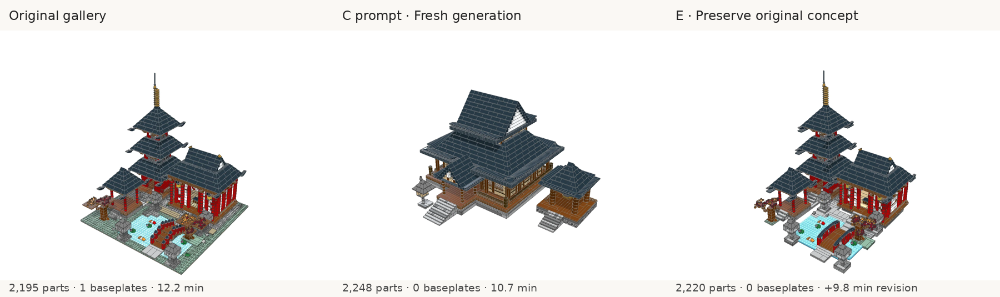

The temple is the strongest demonstration of the new composition rules. Its main hall, freestanding bell pavilion and two lanterns have compact local stone/veranda footings, with smooth dark roof assemblies. The original has a richer pagoda/garden story; the new build better matches a modular LEGO set with the architecture as its subject.

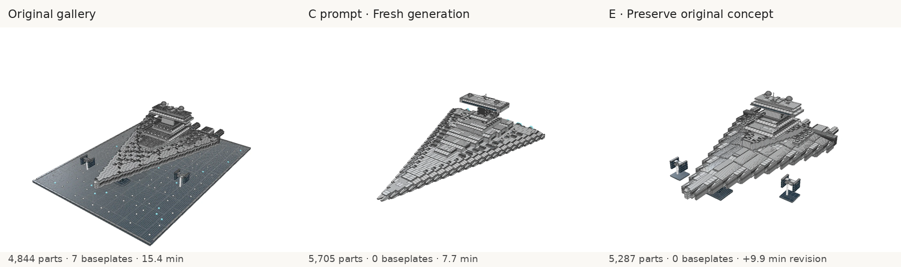

The new ship spends its budget on a tapered grey hull, wedge/sloped panels and greebling rather than seven starfield baseplates. I prefer the new construction treatment. The detailed stepped deck remains deliberate texture, and the hull could still be cleaner. It exceeds the target by 14.1% and has substantial connectivity warnings.

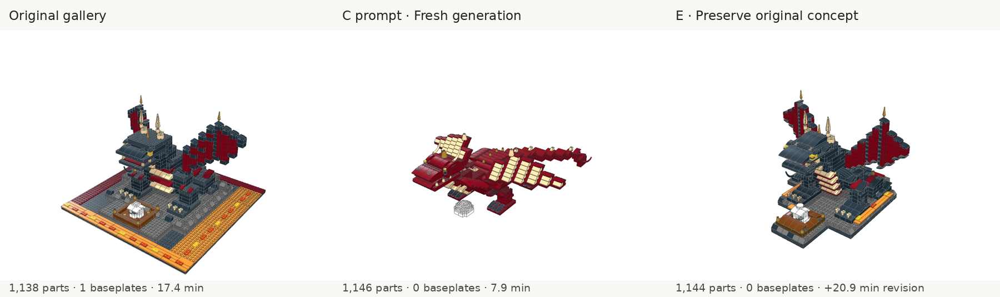

The new dragon has four planted feet, shaped red skin, cream wing panels and a separate egg, replacing the generic lava/lair scene. This is a better LEGO object treatment, but its squat pose, broad muzzle and repetitive segmented tail still need anatomical improvement. Removing the base did not automatically make an excellent creature.

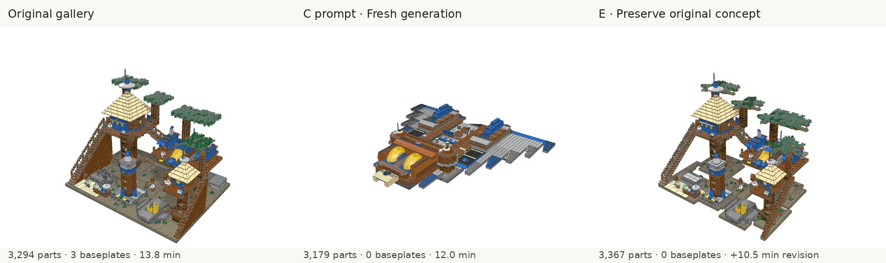

The new build chooses a freestanding timber/Classic Space spacecraft with blue-grey wings, yellow cockpit and landing feet. I prefer its part/surface treatment; the original forest settlement conveys more of an Ewok environment. These are different concept interpretations, so this is not proof that the new prompt is universally more creative.

## Run measurements

| Case                        | Parts / target | Baseplates |           Generation time | Attempts |
| --------------------------- | -------------: | ---------: | ------------------------: | -------: |
| Pelican · A                 |      873 / 800 |          0 |                   9.7 min |        1 |
| Piplup · A                  |  1,074 / 1,000 |          0 |                   6.3 min |        1 |
| Pelican · B                 |      889 / 800 |          0 |                   9.5 min |        2 |
| Piplup · B                  |  1,096 / 1,000 |          0 |                  12.1 min |        1 |
| Piplup · C revision         |  1,143 / 1,000 |          0 | +4.0 min (16.1 min total) |        1 |
| Pelican · C revision        |      867 / 800 |          0 | +8.2 min (17.7 min total) |        1 |
| Destroyer · Finished, fresh |  5,705 / 5,000 |          0 |                   7.7 min |        1 |
| Temple · Finished, fresh    |  2,248 / 2,000 |          0 |                  10.7 min |        1 |
| Ewok · Finished, fresh      |  3,179 / 3,000 |          0 |                  12.0 min |        1 |
| Dragon · Finished, fresh    |  1,146 / 1,000 |          0 |                   7.9 min |        1 |
| Piplup · D references       |  1,135 / 1,000 |          0 |                   7.8 min |        1 |
| Pelican · D references      |      890 / 800 |          0 |                   5.5 min |        1 |

Times include model/search/check/repair work and exclude the final render. C's total includes its B parent. Every accepted build has zero compiler errors; warning records are retained in [metrics.json](metrics.json) and per-build `compile.json`. All part targets are soft size scores, not hard acceptance gates.

## Follow-up: preserve the preferred concept

The owner preferred the original temple and Ewok builds. The fresh finished-prompt builds changed the concept as well as the construction: a colourful pagoda/garden composition became a brown standalone hall, and an Ewok/Classic Space settlement became a spacecraft. Smoother surfaces and smaller support footprints did not compensate for those changes.

**E — concept-preserving construction revision** uses [the contextual prompt](../../../prompts/build-agent-contextual.md) and the same generic revision instructions for all six briefs. It distinguishes composition from support: a setting and its meaningful environment may be the subject, while a ground slab is only one support choice. It explicitly preserves a supplied draft's meaningful components, arrangement, distinctive palette, theme and interactions. Named LEGO-set examples are distilled into general techniques. Original source and three original gallery views are supplied as input; no subject-specific repair coordinates or palettes are added to the guidance.

This is a revision of a preferred source, not a fresh-generation test or an isolated prompt ablation. The existing original and fresh candidates are retained for comparison. Evaluate concept/composition retention separately from surface/support treatment; a reduction in baseplates or exposed studs does not compensate for losing a preferred scene. Replacing a single large baseplate with regular plate foundations can also increase the part count, so the target miss and added revision cost remain explicit.

### E results

Both revisions retain the preferred composition while replacing generic ground slabs with local plate-built foundations/patches. I prefer E to the fresh finished-prompt versions for both subjects. The temple retains the red pagoda, hall, pond, moon bridge, lanterns and bell pavilion, with more finished stone approaches and a bowed bridge. The Ewok revision retains the tree settlement, huts, bridges, launch cradle, spacecraft and blue/yellow Classic Space details; layered crowns give the trees more depth. The ground's deliberate studs remain natural texture. The original unified ground can still provide stronger diorama cohesion; a compact shared base remains a valid design choice when that is what the owner prefers.


| E revision   | Original parts | Revised parts / target |  Net change | Baseplates | Added generation time |
| ------------ | -------------: | ---------------------: | ----------: | ---------: | --------------------: |
| Temple       |          2,195 |          2,220 / 2,000 | +25 (+1.1%) |      1 → 0 |               9.8 min |
| Ewok village |          3,294 |          3,367 / 3,000 | +73 (+2.2%) |      3 → 0 |              10.5 min |

Both accepted on their first attempt after two draft checks with zero compiler errors. The targets remain soft scores: +11.0% and +12.2%. These are source-conditioned revisions with additional compute, not proof that the contextual prompt generates superior fresh concepts. Attachment diagnostics remain substantial: E temple has 583 parts in 79 groups outside the main structure plus one clash warning; E Ewok has 1,473 parts in 333 groups plus ten off-grid parts. Some independence is intentional, but this does not establish physical buildability or an improvement in attachment quality. Per-build compiler reports retain the diagnostics.

The practical process is to retain a preferred concept and compare candidate construction revisions against it. Score concept/composition and construction separately; neither low stud counts nor absence of baseplates should automatically select the winner. For fresh generation, permit a standalone object, interacting modules or a composed setting according to the request rather than making either scenery or freestanding composition mandatory.

## Remaining gallery builds with E

The remaining four use the unchanged contextual prompt, identical generic preservation instructions, GPT-6.1-Sol high, the original gallery targets and each original source plus three input views. Together with the temple and Ewok revisions this completes E for all six briefs. This measures source-conditioned revision, not fresh generation using E alone.

| E revision     | Original parts | Revised parts / target |    Net change | Baseplates | Added generation time |
| -------------- | -------------: | ---------------------: | ------------: | ---------: | --------------------: |
| Pelican        |            852 |              882 / 800 |   +30 (+3.5%) |      2 → 0 |               7.9 min |
| Piplup         |          1,056 |          1,228 / 1,000 | +172 (+16.3%) |      1 → 0 |               9.3 min |
| Dragon         |          1,138 |          1,144 / 1,000 |    +6 (+0.5%) |      1 → 0 |              20.9 min |
| Star Destroyer |          4,844 |          5,287 / 5,000 |  +443 (+9.1%) |      7 → 0 |               9.9 min |

All four accepted in one attempt with zero compiler errors and four final views. Pelican/Destroyer use two draft checks; Piplup/Dragon use three. Size remains a soft score: final misses are +10.3%, +22.8%, +14.4% and +5.7%, respectively. The dragon's longer 20.9-minute generation cost is explicit; E is not a cheap or universally superior replacement for the earlier variants.

### Pelican

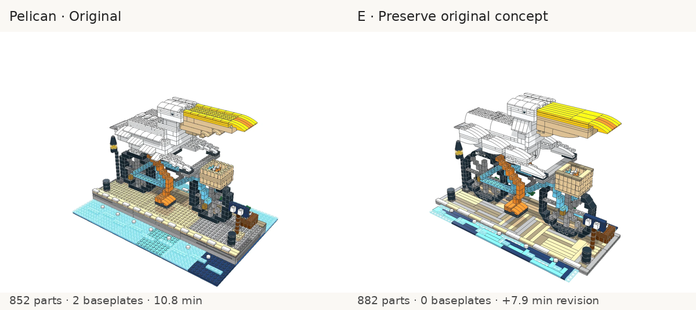

E keeps the fish-delivery harbour story, trims the water to local patches and gives the quay a finished surface. The beak, wing sides and some body surfaces use more deliberate curves. Its broad back still exposes many studs, and the brick-built wheels remain blocky. **D remains my overall pelican visual pick** for its more coherent bird and real wheel parts; E is useful if retaining the original scene is the priority.

### Piplup

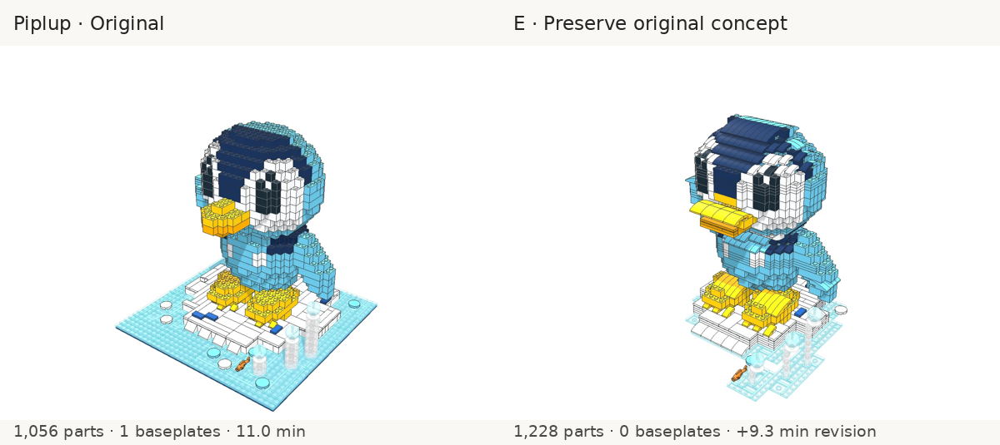

E preserves the rounder head, waving pose, drifting iceberg, fish and bubbles. It has more character than C/D's square-headed versions, with shaped crown/body surfaces and a smaller irregular display footprint. Ring ledges, feet and the raised arm remain visibly stepped/studded, and the broad beak is less subtle. B retains the cleaner hood finish. **E is the stronger original-concept revision; B remains a cleaner surface alternative.** E uses 16.3% more parts than the original and misses the gallery target by 22.8%, so its appearance is not an equal-part-budget win.

### Dragon

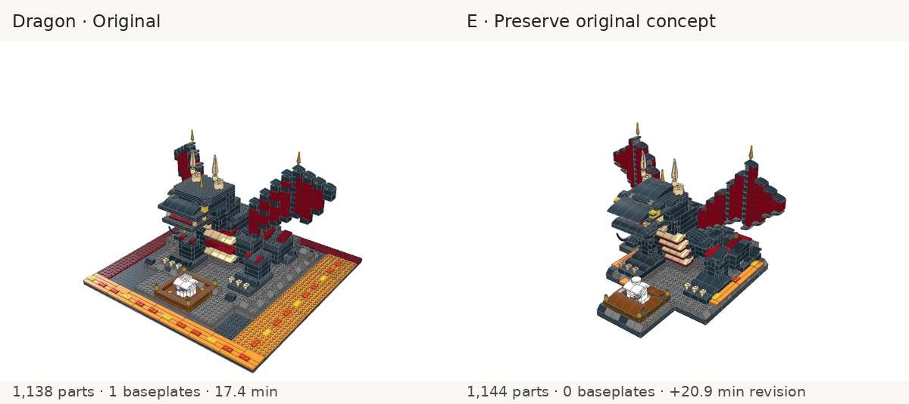

E preserves the raised sheltering wings, arched neck, dark armour/crimson palette and guarded egg. It fits the scene onto a more compact plate-built outcrop and shapes the head, shoulders, haunches, tail and nest with deliberate curves/slopes. I prefer its original guarding composition to the fresh red quadruped's squat pose. Its wings still have a stepped outline and the neck/core remains visibly blocky; preserving a source concept can also anchor its geometric weaknesses. The final count is only six parts above the original, but the model/check stage takes 20.9 minutes.

### Star Destroyer

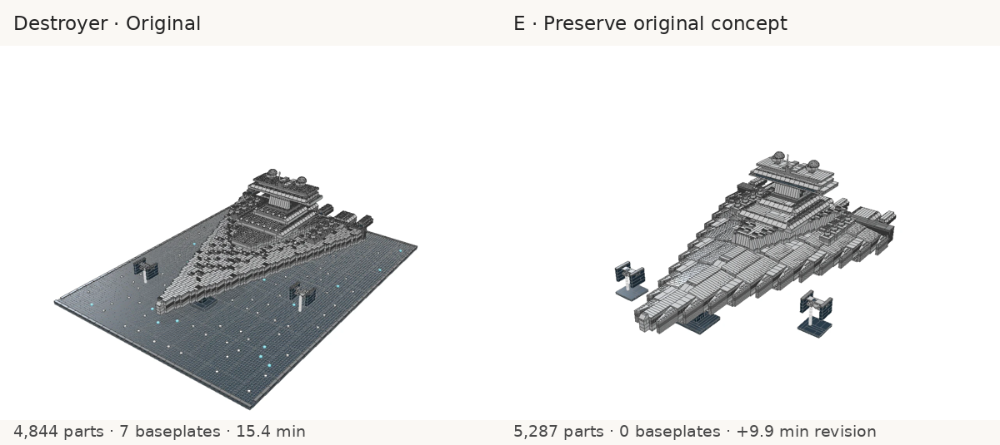

E retains the command citadel, capture bay/blockade runner and TIE patrol, using compact flight cradles instead of the seven-baseplate starfield. Armour planes and the bridge treatment are more deliberate and smooth; exposed studs concentrate in machinery/greebling. I prefer E's fleet composition and bridge treatment to the fresh ship-only version, while the outer hull edge remains conspicuously stepped/castellated. The earlier fresh C hull has a cleaner overall taper. Both are useful candidates, not an unqualified E win.

[All six E models together](e-overview.png) · [Switch angles and compare every variant](index.html)

Compiler warnings remain material. The four E builds have, respectively, 642 parts in 185 groups, 275 in 227, 503 in 92 and 1,035 in 91 outside the main structure. Pelican has three clash warnings, Dragon one; off-grid counts are 11, 4 and 38 for Pelican, Piplup and Dragon. Some separate assemblies are intentional and connection coverage is incomplete; these results do not certify physical buildability or improved attachment quality. Full diagnostics, source hashes, timing and provenance remain in the per-build files and study manifests.

## Text-only E/F comparison

The owner requires generation to remain a spatial reasoning challenge for any LLM, as in MineBench. This follow-up pairs the unchanged contextual E prompt with **F — economical construction**, using each identical original gallery source and the same generic revision request. Neither receives input images, reference renders or draft render feedback. Accepted builds are rendered afterwards solely for human comparison. The earlier image-conditioned E builds remain separately labelled historical comparisons.

F combines four build-agnostic changes: preserve design intent while permitting replacement of dimensions, internal geometry and part choices; replace weak construction instead of adding covering layers; remove architectural recipes/part cheat sheets and use a syntax-only reply example; audit concept retention, proportions/silhouette, surface finish, connections and cost separately. The same technical geometry rules and counting estimates remain. F's filled inputs are about 5,700 characters shorter than E's. It adds no per-subject recipes, repair coordinates, palettes or external images.

All twelve runs use GPT-6.1-Sol high, original briefs/targets, identical pinned parts/colours, text part search, three compiler checks per attempt and up to five repair attempts. Checks still return only counts, sections and compiler errors. The harness defaults revisions to text-only and rejects image inputs for F. Exact prompts, original-source hashes, revision requests, compiler reports, accepted sources and final four-view captures are retained. E/F request files for each subject must match byte-for-byte.

This evaluates the combined F changes, not their individual causal contribution. There is one sample per prompt/subject, and source-conditioned revision uses extra compute compared with the historical gallery generation. No cross-model generalization or superiority in fresh generation is established.

All twelve paired runs completed with zero compiler errors and four final views each. They contain 0 baseplate parts in total; local plate-built supports and meaningful terrain remain. The viewer now contains 36 previewed models: six originals, eighteen historical experiments and twelve new text-only E/F builds. The [provenance manifest](provenance.json) verifies all thirty completed new runs, including zero image inputs for every new text-only case. Every E/F pair has byte-identical revision requests and original-source hashes.

The batch ended with exit 143 while F Ewok was incomplete. Its partial logs are preserved in `.local/lego-study/interrupted-text-only`, and a clean rerun used byte-identical source/request/prompt inputs. No partial result is scored; [interruptions.json](interruptions.json) records the exclusion. Times below describe completed generation/search/check/repair work, exclude final rendering and exclude that interrupted work.

| Subject   | E parts | F parts | F change vs E | E / F generation time | Visual pick |
| --------- | ------: | ------: | ------------: | --------------------: | ----------- |
| Pelican   |     918 |     867 |           -51 |        8.8 / 11.0 min | E           |
| Piplup    |   1,007 |     949 |           -58 |        6.5 / 20.4 min | E           |
| Temple    |   2,200 |   2,049 |          -151 |       10.8 / 14.0 min | F, narrowly |
| Dragon    |   1,146 |   1,144 |            -2 |        9.4 / 19.2 min | F, narrowly |
| Destroyer |   5,334 |   4,287 |        -1,047 |        8.9 / 16.1 min | E           |
| Ewok      |   3,517 |   3,337 |          -180 |       13.7 / 11.4 min | F           |

### Pelican: E

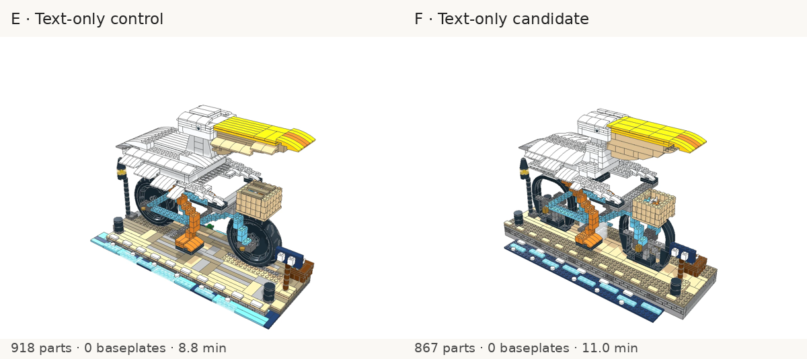

E uses actual motorcycle wheel/tyre assemblies and has the stronger bicycle. F gives the bill a deeper pouch and shapes the back more coherently, but constructs its wheel outlines from arches/slopes and retains broad studded shelves. F saves 51 parts; it is a useful bird-shell alternative, not my overall winner. The historical image-reference D bird remains a distinct visual candidate, outside this text-only controlled comparison.

[Original, historical E and both text-only variants](pelican-text-iso.png) are retained together; use [the viewer](index.html) for front/back comparisons.

### Piplup: E

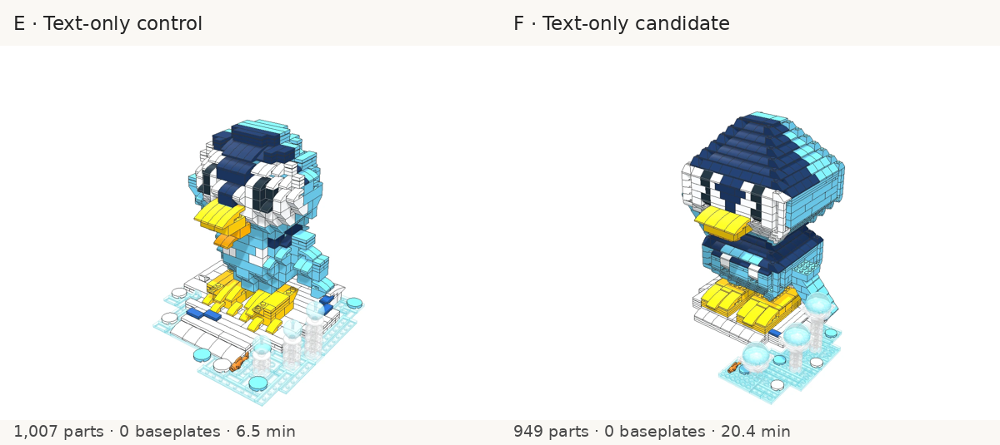

F improves part economy and removes E's clash warning records, but its smooth shell produces a pointed, boxy cap and rectangular face. E has a rounder character despite an oversized bill and terraced crown. I prefer E in this pair; neither resolves all the anatomy problems seen in the earlier gallery comparisons. F takes over 20 minutes versus E's 6.5, so the shorter input does not make this sample faster.

[Original, historical E and both text-only variants](piplup-text-iso.png) are retained together; use [the viewer](index.html) for front/back comparisons.

### Temple: F, narrowly

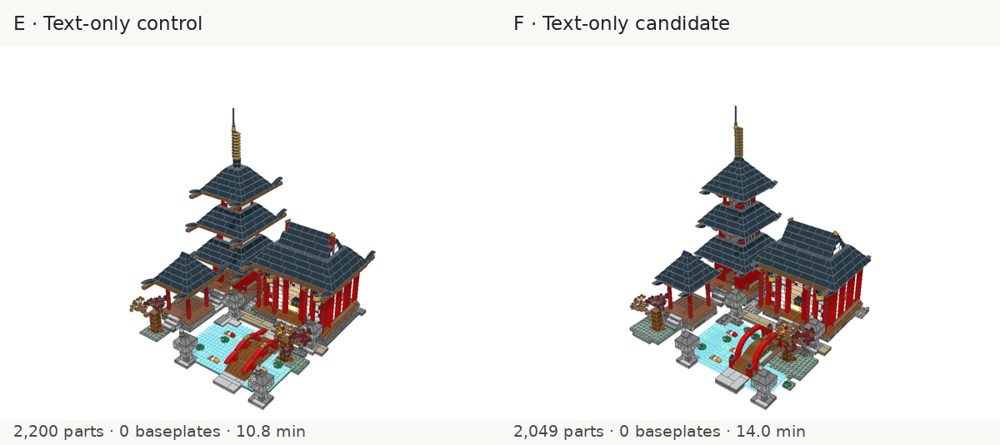

Both preserve the red pagoda, worship hall, pond, bridge, lanterns and bell pavilion the owner preferred. F saves 151 parts and uses a clearer curved arch for the bridge; E has stronger upturned eaves and a more ornate roof profile. F is my narrow construction pick while retaining the preferred scene, rather than substituting the earlier brown standalone hall concept.

[Original, historical E and both text-only variants](temple-text-iso.png) are retained together; use [the viewer](index.html) for front/back comparisons.

### Dragon: F, narrowly

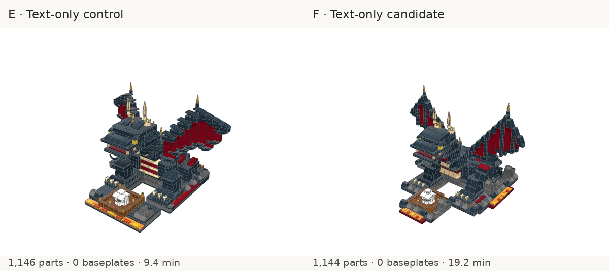

F has a sharper wing outline and more coherent head/back shaping at essentially the same count, preserving the upright guarding pose, dark armour, crimson wings and nest. I narrowly prefer F. Both keep a blocky core and box-like egg; F adds a round cap rather than rebuilding its whole form. F needs a second repair attempt and takes about twice E's generation time.

[Original, historical E and both text-only variants](dragon-text-iso.png) are retained together; use [the viewer](index.html) for front/back comparisons.

### Destroyer: E

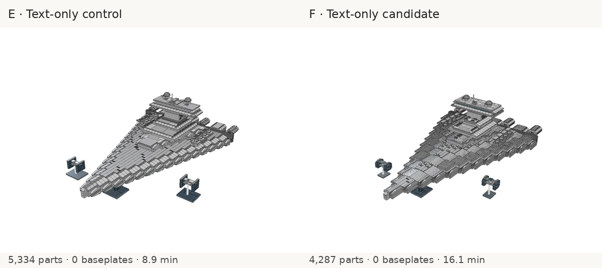

E has the more consistently finished deck and my preferred surface treatment. F improves the command bridge proportions and saves 1,047 parts, using more slopes but fewer tiles and exposing more studs across the deck. Its perimeter still reads as a staircase. Its 502 groups outside the main structure, versus E's 100, regress the connection signal. The overall bounds remain comparable; this is not simply a smaller ship. Both retain the capture/fleet composition and compact stands.

[Original, historical E and both text-only variants](destroyer-text-iso.png) are retained together; use [the viewer](index.html) for front/back comparisons.

### Ewok: F

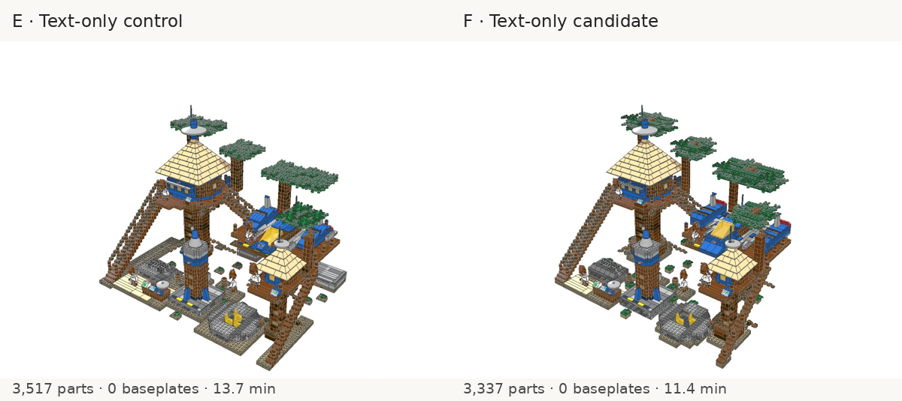

F retains the tree village, huts, connecting bridges, launch platform, spacecraft, inhabited scene and blue/yellow Classic Space details. Its layered canopies have more depth than E's flat crowns, the ship's curved blue nose/bodywork reads more clearly, and plants have small coherent footings rather than isolated specks on the table. It saves 180 parts and lands within the suggested size range; E is 17.2% over target. I prefer F in this pair. Both still have very regular trunks/crowns and fragmented ground, so the original unified forest display remains a valid composition preference.

[Original, historical E and both text-only variants](ewok-text-iso.png) are retained together; use [the viewer](index.html) for front/back comparisons.

### Assessment

I would retain E as the baseline rather than automatically adopt the whole F bundle. F produces useful construction alternatives and generally uses fewer parts, but savings can come with worse anatomy, more exposed studs or weaker connections. The intent-versus-geometry and part-replacement language remain promising, but these combined trials do not isolate which wording caused each improvement or regression. All guidance is shared across subjects; no per-build repairs or visual critiques were sent to generation sessions.

F uses 10.5% fewer parts in aggregate, with most of that saving in the destroyer. Visual preferences split three–three. F takes longer in five of six completed pairs: aggregate generation/search/check/repair time is 92.1 minutes versus E’s 58.2, excluding the interrupted work. This is one sample per cell, not evidence that shorter prompts generally run slower. Part counts are soft scores, not acceptance gates: the table and per-build results retain target misses. Compiler acceptance does not certify physical buildability. Some separate groups are intentionally ground-supported modules, especially in the temple/Ewok settings; hundreds of small detached shell groups are still a relevant warning. Full clash/off-grid/connectivity records are in [metrics.json](metrics.json) and each `compile.json`. Inventory slopes/tiles are proxies, not a measurement of visible studs.

## Recommended next process

The initial trials favoured [the finished workflow](../../../prompts/build-agent-finished.md) for surface treatment. The owner’s preference for the earlier scene compositions shows why that alone is not a universal recommendation. Evaluate the new contextual variant alongside it, using [the matching reply example](../../../prompts/brick-build-object.md), rather than appending a surface rule to the creative prompt. Plan the recognizable silhouette and proportions first, then a connected structure, then a shaped shell with explicit smooth/textured zones. Permit coherent independent assemblies and justify each local support. Choose real wheels, wedges and curves before drawing those forms out of hundreds of tiny blocks.

The useful transfer from `/tmp/minebench` is signature-first concept planning, concrete part search and iterative draft checks. The always-present environment/story and voxel-style massing are poor defaults for this task. D and C remain historical image-input experiments. The owner explicitly requires generation to remain a spatial reasoning challenge without visual feedback, as in MineBench. Current trials therefore supply only text, part metadata and compiler error/count feedback; accepted renders are for human evaluation afterwards. Keep competing versions rather than automatically replacing an accepted design.

Actionable compiler **warnings**, distinguishing supported independent modules from loose pieces within a shell, remain a separate possible tool improvement; the current comparison keeps the existing feedback protocol unchanged. Current `check_build` does not return warnings or images. Source-level hinge/sideways placement is also needed to reproduce the angled wings and SNOT eyes of the official birds. Those are generation/language improvements beyond this prompt trial; none is claimed implemented here. A further untested option is a smaller subject-appropriate part budget: the reference birds have only 28 and 43 leaf parts, whereas these gallery briefs ask for 800–1,000. Forcing many small parts into a simple character can encourage overbuilding; the present study keeps the gallery targets for comparability.

## Public LDraw references

Files were fetched once by a maintainer study with an identifying User-Agent and a four-second pause between requests. Original MPDs, including authorship/licence headers, remain unchanged in `.local/lego-study/omr/`; they are not committed. Rendered derivatives below are attributed under [CC BY 2.0](https://creativecommons.org/licenses/by/2.0/).

| Public model                                                               | Author                                                                                                     | Observation used in B                                                                                                                |
| -------------------------------------------------------------------------- | ---------------------------------------------------------------------------------------------------------- | ------------------------------------------------------------------------------------------------------------------------------------ |
| [30472-1 Creator Parrot](https://library.ldraw.org/omr/sets/1163)          | Marc Giraudet [Mad_Marc]                                                                                   | Freestanding feet, plate core, curved slopes 11477, shaped head and beak, intentionally studded wing wedges.                         |
| [7270-1 Creator Bird](https://library.ldraw.org/omr/sets/178)              | Merlijn Wissink [legolijntje]                                                                              | Inverted-slope belly, hinged wings, sideways eyes on headlight bricks.                                                               |
| [31048-1 Lakeside Lodge](https://library.ldraw.org/omr/sets/1138)          | Stefan Frenz [smf]                                                                                         | Local foundation of plates and wedges, separate moose, smooth roof slopes beside studded grass.                                      |
| [8099-1 Midi-scale Star Destroyer](https://library.ldraw.org/omr/sets/999) | Orion Pobursky [OrionP]                                                                                    | Internal Technic structure and wedge panels; the deck's studs are intentional at this scale.                                         |
| [10315-1 Tranquil Garden](https://library.ldraw.org/omr/sets/1463)         | Orion Pobursky [OrionP]; inline subfiles also credit Vincent Messenet, Evert-Jan Boer and Philippe Hurbain | A bounded display is justified by this subject; it uses regular plates and contrasts smooth water/paving with textured plants/rocks. |

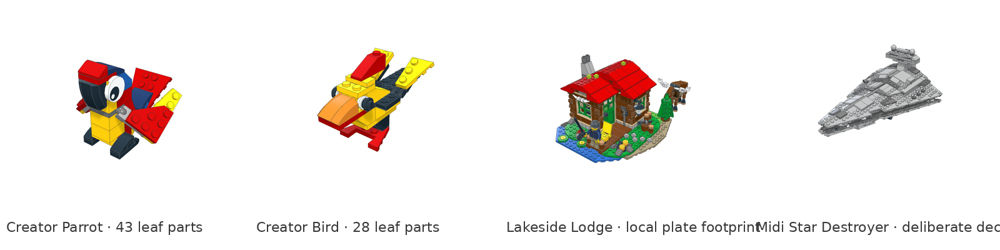

[Reference source hashes](references/sources.json) identify the exact MPDs studied. All five studied sources omit thin baseplate parts. This is a selected sample, not a survey proving that every LEGO theme avoids baseplates. The bird sources also show that recognizable LEGO construction is compatible with some visible studs. The current language's upright quarter-turns cannot reproduce the sources' arbitrary wing angles and sideways eye tiles; B explicitly explains that limit. Tranquil Garden's strict capture failed on unresolved body colours, so its source informed the study but no fallback-colour image is included.

## Reproduce

```sh
export PATH=/tmp/brick-node/node-v22.14.0-linux-arm64/bin:$PATH
npm ci
npm run build
npx tsx scripts/evaluate-build-style.ts --concurrency 4
# Visual revision of B: same prompts, plus each accepted source and its four images.
npx tsx scripts/evaluate-build-style.ts --cases finished-pelican,finished-piplup --revise-from .local/lego-study/runs --source-variant studied --revision-feedback images --out .local/lego-study/visual --concurrency 2
# Fresh builds with official visual references (download/render those sources first).
npx tsx scripts/evaluate-build-style.ts --cases finished-pelican,finished-piplup --reference-images .local/lego-study/omr/30472-1-iso.png,.local/lego-study/omr/7270-1-iso.png --out .local/lego-study/reference --concurrency 2
# Preserve a preferred original concept, with its source and three gallery views.
npx tsx scripts/evaluate-build-style.ts --cases contextual-temple,contextual-ewok --revise-from docs/samples/lego-style-study --source-variant original --revision-feedback images --out .local/lego-study/contextual --concurrency 2
# Complete E on the other four originals with identical guidance and settings.
npx tsx scripts/evaluate-build-style.ts --cases contextual-pelican,contextual-piplup,contextual-dragon,contextual-destroyer --revise-from docs/samples/lego-style-study --source-variant original --revision-feedback images --out .local/lego-study/contextual --concurrency 4
# Current text-only spatial challenge: E control and F candidate share sources.
npx tsx scripts/evaluate-build-style.ts --cases contextual-pelican,economical-pelican,contextual-piplup,economical-piplup,contextual-temple,economical-temple,contextual-destroyer,economical-destroyer,contextual-dragon,economical-dragon,contextual-ewok,economical-ewok --revise-from docs/samples/lego-style-study --source-variant original --revision-feedback text --out .local/lego-study/text-only --concurrency 4
# Additional cases use the exact gallery briefs:
npx tsx scripts/evaluate-build-style.ts --cases finished-temple,finished-dragon,finished-destroyer,finished-ewok --out .local/lego-study/transfer
```

`--reply-prompt brick-build-object.md` selects the example independently of the main prompt. `--images a.png,b.png` attaches input renders to the first Codex call in each attempt; search/check replies retain them through the resumed session. Image runs reject the Claude runner. Full input text, expanded source, compile reports, accepted MPDs, usage and raw reply logs are retained in the study's `.local/` directories. A one-shot reply remains text-only unless images were explicitly supplied.

## Assessment limits

This is a small qualitative experiment with one sample per cell, historical baselines and a more expensive visual revision stage. Parts classified as tiles/slopes are inventory measures, not a measured visible-stud fraction. Zero compiler errors does not prove physical buildability: warnings and language limits remain relevant. For example B pelican has 739 parts in 267 groups outside the main structure, with a largest group of only 84 parts, plus 24 clash warnings; D has 597 parts in 225 groups outside the main structure. These diagnostics are conservative and connector coverage is incomplete, but hundreds of loose shell pieces cannot be explained merely by permitting a few freestanding accessories. Original Piplup has only four singleton groups outside its main structure; C has 521 parts in 144 groups, so visual smoothing also regressed this construction signal. Separate assemblies standing on the table are intentional; unsupported pieces within a subject are still a construction problem.

## E with Astra 6 high

This follow-up changes only the generation model to **GPT-6-Astra (`gpt-6-astra`), high**. Each of the six filled E prompts, generic revision requests and original-source provenance records is byte-identical to the corresponding text-only GPT-6.1-Sol E control. The original part targets, catalogue, search/check protocol, three checks per attempt, five-attempt limit and final cameras are unchanged. No input images, render feedback, shell/browser tools or repository instructions reach generation. Final renders are inspected only after acceptance.

All six accept in one attempt, with zero compiler errors, zero baseplate parts and four captured views. The actual model/effort, absence of images/tools, source hashes and filled inputs are verified. This adds six new runs: the viewer now contains forty-two builds, including the six originals. It is one sample per model per subject; model differences and ordinary generation variance remain confounded. These preferences describe the displayed outputs, not a reliable model ranking.

| Subject   | Sol E parts | Astra E parts | Sol / Astra time | Astra checks | Visual preference |
| --------- | ----------: | ------------: | ---------------: | -----------: | ----------------- |
| Pelican   |         918 |           884 |    8.8 / 5.7 min |            2 | Sol, narrowly     |
| Piplup    |       1,007 |         1,037 |    6.5 / 8.6 min |            3 | Astra, narrowly   |
| Temple    |       2,200 |         2,297 |   10.8 / 9.1 min |            3 | Near tie          |
| Dragon    |       1,146 |         1,072 |   9.4 / 11.6 min |            3 | Astra             |
| Destroyer |       5,334 |         5,272 |    8.9 / 5.5 min |            1 | Sol               |
| Ewok      |       3,517 |         3,181 |   13.7 / 9.3 min |            3 | Astra             |

Across these completed runs, Astra uses 13,743 parts versus Sol's 14,122 (2.7% fewer), and 49.7 versus 58.2 minutes of total generation/check time (14.6% less). Astra is faster in four pairs and slower for Piplup and dragon. These times exclude final rendering and are observed totals on the shared VM, not repeated latency measurements.

My visual picks are Astra for Piplup (narrowly), dragon and Ewok; Sol for pelican (narrowly) and Star Destroyer; temple is a near tie. The strongest changes are dragon wing silhouette and Ewok spacecraft construction. Switching models still does not consistently eliminate stepped outlines or excess studs. Warning records remain substantial and sometimes worsen. The compiler feedback protocol supplies errors/counts, not these warning records; no additional feedback was supplied for this experiment.

### Pelican: Sol, narrowly

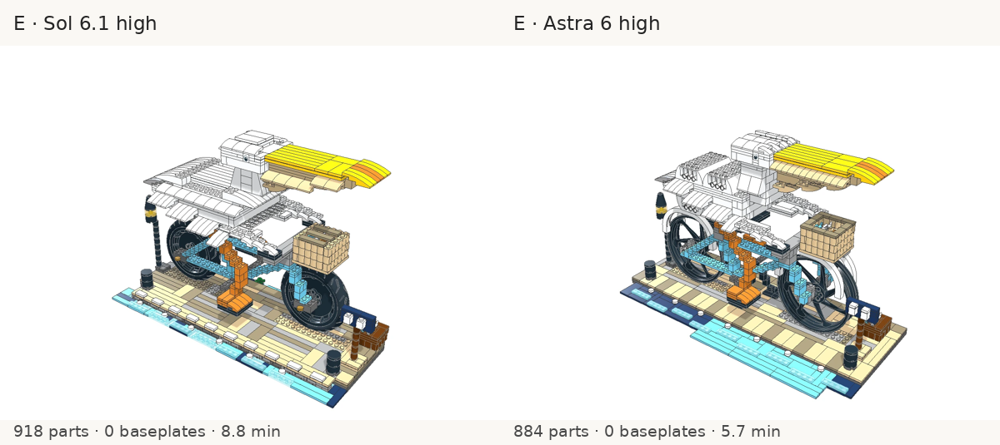

Astra chooses larger native spoked motorcycle wheels, giving the bicycle a clearer outline, but its back exposes more studs and the wings remain stepped. Sol's bird has a more consistently finished surface. I narrowly prefer Sol overall; Astra's bicycle is an appealing alternative. Both preserve the harbour edge, basket and accessories. Astra has 9 clash warnings and 11 off-grid parts, versus Sol's 16 and 31; neither is a proven connected model.

[Front](pelican-astra-front.png) · [Back](pelican-astra-iso-back.png) · [Top](pelican-astra-top.png) · [Astra source](astra-text-only-contextual-pelican/build.js) · [Astra compiler report](astra-text-only-contextual-pelican/compile.json)

### Piplup: Astra, narrowly

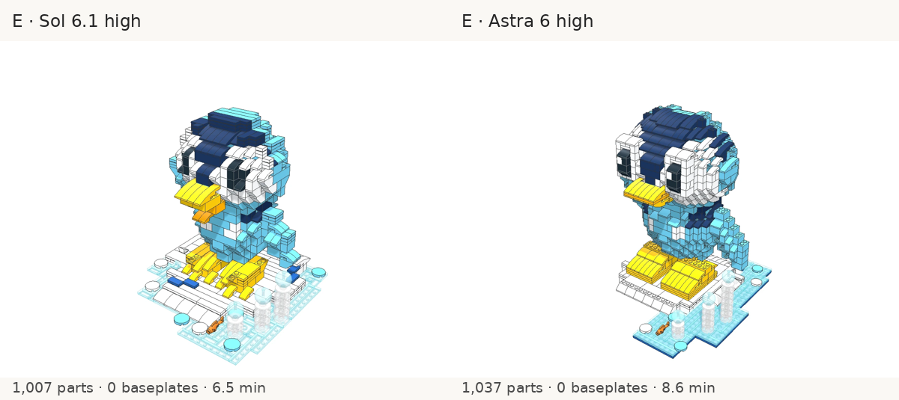

Astra makes the crown rounder and reduces the oversized bill. Its broad square feet lose Sol's explicit toes, and its chest/flippers remain stepped. I narrowly prefer Astra's face and overall proportions, with that foot regression kept explicit. Its part count falls from 1,687 in the first check to 1,037 at acceptance. Diagnostics worsen: 9 clash warnings versus 4, with 738 parts in 165 groups reported as not connected to the main structure versus Sol's 449 in 144; off-grid counts remain four. The visual preference is not a construction-quality win.

[Front](piplup-astra-front.png) · [Back](piplup-astra-iso-back.png) · [Top](piplup-astra-top.png) · [Astra source](astra-text-only-contextual-piplup/build.js) · [Astra compiler report](astra-text-only-contextual-piplup/compile.json)

### Temple: Near tie

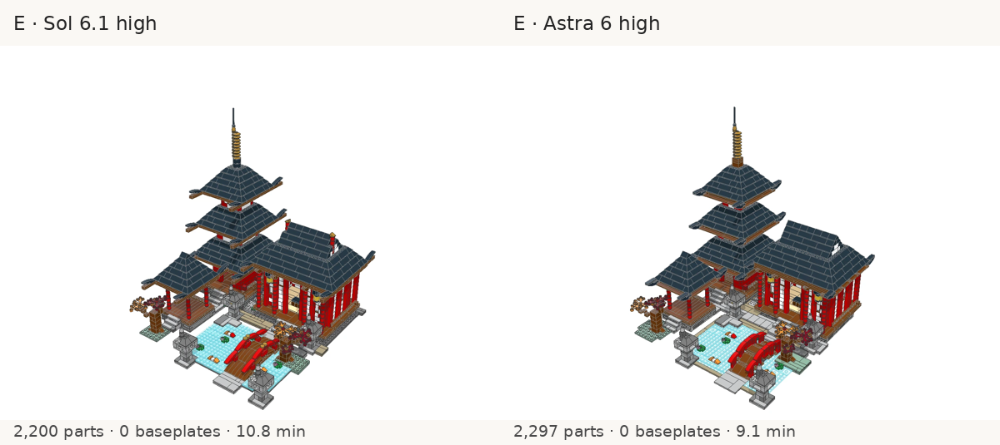

The outputs are very close: both retain the red pagoda, hall, pond, moon bridge, lanterns, bell pavilion and autumn trees. Astra gives the stone approach more substantial courses and keeps the same finished roofs, at 97 additional parts. I call the visual result a near tie rather than force a winner. Neither has clash/off-grid warnings, but Astra has 234 groups reported as not connected to the main structure versus Sol's 80. Multiple coherent freestanding modules are valid; this diagnostic alone does not prove loose or supported construction.

[Front](temple-astra-front.png) · [Back](temple-astra-iso-back.png) · [Top](temple-astra-top.png) · [Astra source](astra-text-only-contextual-temple/build.js) · [Astra compiler report](astra-text-only-contextual-temple/compile.json)

### Dragon: Astra

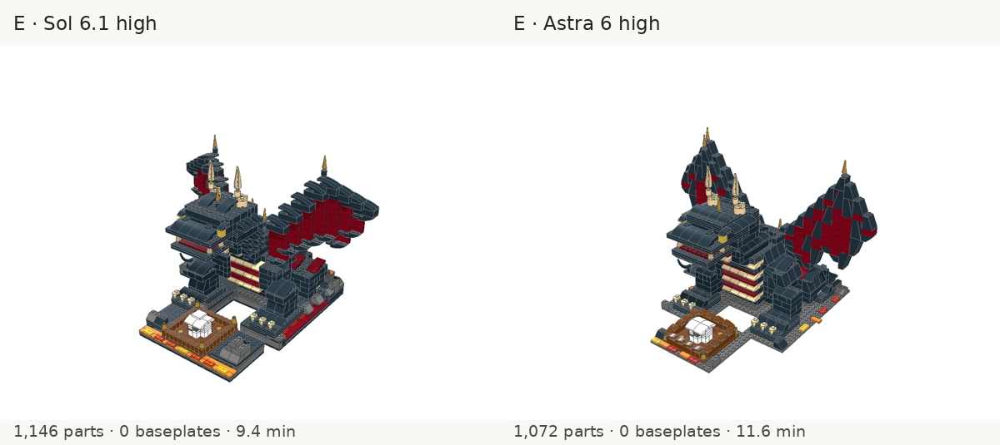

Astra replaces the rounded horizontal wing terraces with sharper tapered outlines and larger sloped faces. That is the clearest silhouette improvement in this pair, and my preference is Astra. The head/body remain squared and the white egg is still box-shaped. It reduces the first checked draft from 1,820 to 1,072 parts and clears its hard overlap errors, but records 27 clash warnings versus Sol's 13. Improved wing appearance does not certify valid attachments or physical buildability.

[Front](dragon-astra-front.png) · [Back](dragon-astra-iso-back.png) · [Top](dragon-astra-top.png) · [Astra source](astra-text-only-contextual-dragon/build.js) · [Astra compiler report](astra-text-only-contextual-dragon/compile.json)

### Destroyer: Sol

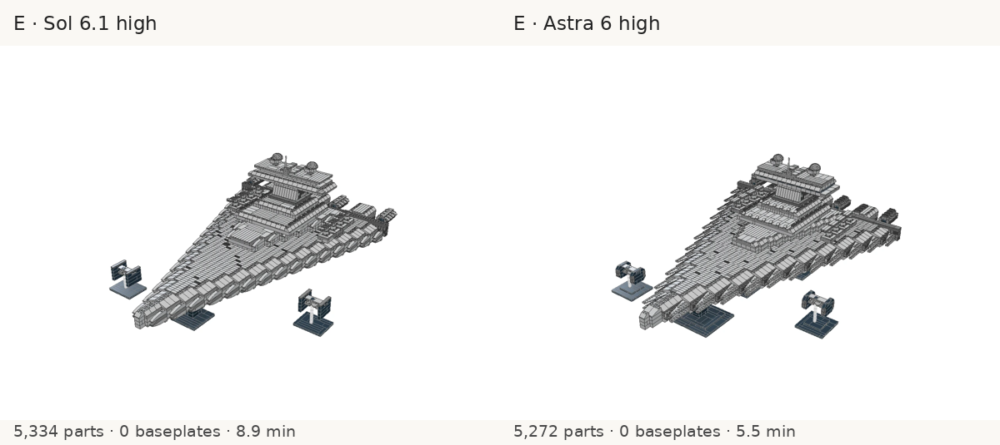

Both retain the tiled deck, bridge, capture-bay composition and independently supported TIE models. Astra leaves more exposed studded gaps along the repeating outer armour and uses very box-like rear engine bays; the stepped perimeter remains. I prefer Sol's more continuous hull finish. Astra saves only 62 parts, although the measured generation time drops from 536 to 327 seconds. Neither has clash/off-grid warnings; Astra's main connected group increases from 3,629 to 4,111 parts, with fewer outside groups (94 versus 100). This diagnostic improvement does not resolve the outline.

[Front](destroyer-astra-front.png) · [Back](destroyer-astra-iso-back.png) · [Top](destroyer-astra-top.png) · [Astra source](astra-text-only-contextual-destroyer/build.js) · [Astra compiler report](astra-text-only-contextual-destroyer/compile.json)

### Ewok: Astra

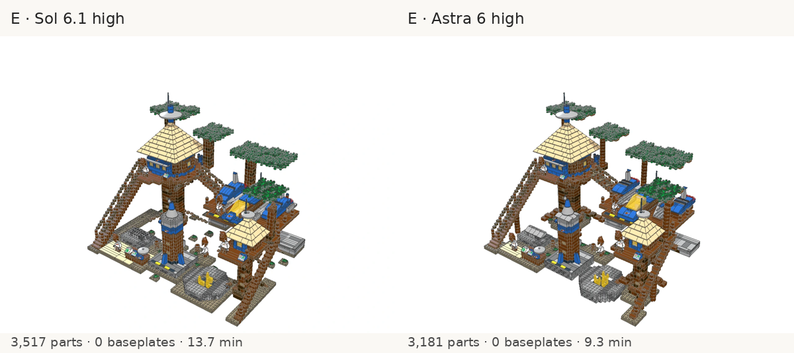

Astra preserves the tree settlement, huts, bridges, stairs, launch platform, spacecraft, rocket and Classic Space palette. The blue spacecraft has a clearer shaped nose and smoother bodywork, and local ground paths read more coherently than Sol's scattered tiny patches. I prefer Astra in this pair. Flat tree crowns, regular trunks and blocky supports remain, and the original unified forest display is still a valid composition preference. Astra saves 336 parts and completes in 556 seconds versus 823. Both record ten off-grid parts and connectivity warnings; these remain source-conditioned revisions, not fresh design tests.

[Front](ewok-astra-front.png) · [Back](ewok-astra-iso-back.png) · [Top](ewok-astra-top.png) · [Astra source](astra-text-only-contextual-ewok/build.js) · [Astra compiler report](astra-text-only-contextual-ewok/compile.json)

### Reproduce the Astra comparison

```sh
npx tsx scripts/evaluate-build-style.ts \
  --model gpt-6-astra \
  --cases contextual-pelican,contextual-piplup,contextual-temple,contextual-dragon,contextual-destroyer,contextual-ewok \
  --out .local/lego-study/astra-text-only --concurrency 3 \
  --revise-from docs/samples/lego-style-study --source-variant original \
  --revision-feedback text
```

The harness defaults to GPT-6.1-Sol high and now accepts `--model`; effort remains high. An existing result from another model is rejected rather than silently reused. Experimental prompts, gallery defaults and published builds are unchanged. Accepted sources, MPDs, exact prompts, revision provenance, measurements and four views are retained beside each build.
